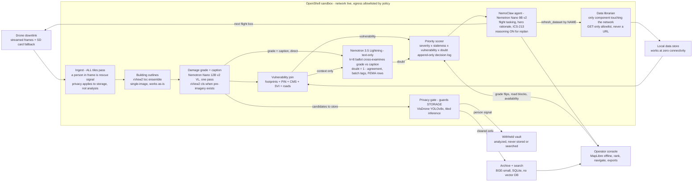

# FIRST LIGHT

**Offline disaster triage on one NVIDIA DGX Spark. Aerial photos in, ranked rescue plan out - with the room's network left plugged in, because policy keeps this box offline, not luck.**

Built for the NVIDIA DGX Spark Hackathon, August 2026. Three builders, one weekend,
one box.

**Status: running.** The pipeline, console, privacy gate, uncertainty ballot and
exports are wired and measured on `gn100-2714`. Every number in this README came off
that machine via the tools in `service/tools/`, and the sections below say plainly
what is still a labelled stub. Sections 1-13 after the reference material are the
original pre-event design document, kept for the reasoning; where they disagree with
a measured number, the measured number wins.

---

## 1. The pitch

After Hurricane Helene, roughly 74% of cell towers in the worst-hit counties failed ([FCC report](https://docs.fcc.gov/public/attachments/DOC-406055A1.pdf)). That is exactly when drone teams are collecting hundreds of gigabytes of damage imagery that can reach no cloud.

FIRST LIGHT is a county-owned box that turns a live drone downlink into a ranked, navigable rescue plan with no cloud and no dependency on connectivity:

`ingest every tile -> outlines + damage grade -> vulnerability join -> uncertainty cross-examination -> auditable ranking -> next-flight tasking -> FEMA paperwork`, with the privacy gate guarding what gets **stored**

Two things make it a winner rather than a dashboard:

1. **It closes the loop.** The deployed state of the art (TAMU's CLARKE) emits one damage map and stops. We rank the doors, task the next flight, and re-rank on what comes back.
2. **It is contained on purpose.** An agent that tasks drones and drafts federal forms is an agent worth containing. Everything runs as a NemoClaw agent inside an NVIDIA OpenShell sandbox, and we leave the venue network **on** so the judges can watch OpenShell refuse an outbound request in real time, audit line printed on screen.

**Track:** See (streaming perception) + Do (contained agent).
**Bounties targeted:** Nemotron, Nemotron Lightning, NemoClaw + OpenShell.

> **Rules check, first 30 minutes.** We prototyped this concept before the event to de-risk the design. Confirm the event's fresh-code rules at check-in, write all submission code during the event, and disclose the earlier spike wherever the rules ask. The design is proven; the build is the weekend's work. Nobody claims otherwise on stage.

## Quick start

Three vLLM servers, then the service. Everything is loopback; nothing reaches the
network.

```bash
# 0. Environment. No API keys - see .env.example for why there are none.
cp .env.example service/.env
cd service && set -a && . .env && set +a

# 1. Python deps (once). Torch/vLLM come from the Spark's base image.
python3 -m venv .venv && .venv/bin/pip install -r requirements.txt

# 2. Model servers. Three pools, co-resident, utilization split so they fit.
vllm serve --model nvidia/NVIDIA-Nemotron-Nano-9B-v2-FP8 \
  --served-model-name nano --port 8000 --gpu-memory-utilization 0.25 \
  --max-model-len 8192 --trust-remote-code &
vllm serve --model nvidia/NVIDIA-Nemotron-3.5-Lightning-30B-A3B-NVFP4 \
  --served-model-name lightning --port 8001 --gpu-memory-utilization 0.35 \
  --max-num-seqs 16 --trust-remote-code &
vllm serve --model <path-to>/NVIDIA-Nemotron-Nano-12B-v2-VL-FP8 \
  --served-model-name captioner --port 8002 --gpu-memory-utilization 0.22 \
  --max-num-seqs 4 --trust-remote-code &

# 3. The service.
PYTHONPATH=$PWD .venv/bin/python -m uvicorn app.main:app \
  --host 0.0.0.0 --port 8081 --log-level warning
```

Or use the supplied script, which also waits for readiness rather than assuming it:

```bash
bash service/tools/restart.sh          # stop, start, poll /api/status until it answers
```

Then open **`http://<box>:8081/`**. The console starts empty; it fills in when you
upload. Tests: `cd service && python -m pytest tests/ -q` (318 pass).

---

## Tech stack

| Layer | Choice | Why this one |
|---|---|---|
| Serving | **vLLM** x3 pools | Continuous batching is what makes concurrent tile grading pay; utilization splits let three models be co-resident instead of swapped |
| Grader | **Nemotron Nano 12B v2 VL FP8** | Grades damage 0-3 from pixels with guided JSON. ~2.2 s per building crop, measured |
| Cross-examiner | **Nemotron 3.5 Lightning 30B A3B NVFP4** | Never sees pixels. Votes k=8 on the grader's own caption; the spread becomes `doubt` |
| Planner | **Nemotron Nano 9B v2 FP8** | Drafts flight tasking. 23.9 tok/s measured |
| Embedder | **BGE-small-en-v1.5** | Caption search. **CPU-pinned**: with three vLLM pools resident the GPU allocator is full and it OOMs |
| Privacy gate | **VisDrone-trained YOLOv8x** | People at aerial scale, where COCO-trained detectors go blind. Tiled 1280 px / 20% overlap |
| API | **FastAPI + uvicorn** | One process, sync handlers, `asyncio.to_thread` for the blocking pipeline |
| Store | **SQLite** (WAL) | One file, no daemon. Decision log is append-only enforced by SQL triggers |
| Console | **Vanilla ES modules + MapLibre GL** | No build step, no framework, no CDN. Basemap tiles and SDF glyphs served from disk |

## Architecture

```
  drone downlink                        ONE BOX, NETWORK UNPLUGGED
  ┌──────────────┐
  │ watch folder │──┐
  │ HTTP upload  │──┤
  └──────────────┘  │
                    ▼
        ┌───────────────────────┐   withheld
        │ 1. PRIVACY GATE       │──────────────► vault (analyzed, never stored,
        │    YOLOv8x, tiled     │                never thumbnailed, never indexed)
        └───────────┬───────────┘
                    │ pixels cleared OR withheld - EITHER WAY, analysis continues
                    ▼
        ┌───────────────────────┐
        │ 2. OUTLINES + GRADE   │  footprints ─► crops ─► VL grade 0-3 + caption
        │    8 VL calls, 8 lanes│  (the rest take a LABELLED pixel-stat stub)
        └───────────┬───────────┘
                    ▼
        ┌───────────────────────┐
        │ 3. VULNERABILITY JOIN │  parcels · addresses · care facilities · CDC SVI
        └───────────┬───────────┘
                    ▼
        ┌───────────────────────┐
        │ 4. UNCERTAINTY BALLOT │  Lightning votes k=8 on the caption
        │    flat pool, budgeted│  vote spread ─► `doubt`
        └───────────┬───────────┘
                    ▼
        ┌───────────────────────┐
        │ 5. ARCHIVE WRITER     │  the ONLY storage door. Gate verdict enforced HERE,
        │    caption + embedding│  so the add-image and metadata-edit paths re-run it
        └───────────┬───────────┘
                    ▼
     priority = severity x staleness x vulnerable_density x doubt
                    │
     ┌──────────────┼──────────────┬──────────────┐
     ▼              ▼              ▼              ▼
  RANK          DISPATCH        ARCHIVE        FLIGHT
  worklist      by agency       semantic       next survey box
  + doubt       + routes        search         + serpentine path
                    │
                    ▼
     append-only decision log ──► FEMA PDA · ICS-213 · aid package
```

Every arrow is one process on one box. The only network traffic is the browser
talking to `:8081` and the service talking to `127.0.0.1`.

---

## Reproducing the demo

**No API keys exist in this project.** `.env.example` is the complete environment;
copy it and change `FIRSTLIGHT_DATA`. The full step-by-step, with what to expect at
each stage, is **[docs/RUNBOOK.md](docs/RUNBOOK.md)**; the recorded-demo script is
**[docs/SCREENPLAY.md](docs/SCREENPLAY.md)**.

```bash
# 1. Clean slate, so the console starts empty and fills in live
cd service && FIRSTLIGHT_AOI=bay FIRSTLIGHT_DATA=$PWD/data PYTHONPATH=$PWD \
  .venv/bin/python tools/reset_clean.py --apply
bash tools/restart.sh

# 2. Pick a spread of real NOAA frames as test input
.venv/bin/python tools/pick_test_images.py --n 6 --out /tmp/firstlight_test_images

# 3. Upload them: the console's "Upload drone images" button, or the watch folder
cp /tmp/firstlight_test_images/* data/watch/
```

Env vars that matter are documented inline in `.env.example`. The ones you are most
likely to change:

| Variable | Default | Effect |
|---|---|---|
| `FIRSTLIGHT_AOI` | `pinellas` | Area of operations. Use `bay` for the Panama City demo imagery |
| `FIRSTLIGHT_DATA` | `service/data` | Imagery, datasets, thumbnails, SQLite |
| `FIRSTLIGHT_VL_CALLS_PER_TILE` | `8` | Model grades per tile. Higher = better coverage, slower tile |
| `FIRSTLIGHT_VL_CONCURRENCY` | `8` | VL calls in flight. The measured knee on this box |
| `FIRSTLIGHT_GATE_CONF` | `0.50` | Privacy gate threshold. Lower trades review clicks for recall |
| `FIRSTLIGHT_REVIEW_TOKEN` | *(empty)* | Non-empty enables the withheld-image review route |

**Selecting the `.bounds.json` sidecars matters.** The NOAA frames carry no EXIF
GPS, and the geo chain is GeoTIFF transform -> EXIF GPS -> sidecar. Without the
sidecar a tile lands in `NEEDS GEO` and cannot be graded until an operator drags it
onto the map.

### Measured on this box

Regenerate all of these with the tools in `service/tools/`; `measure_for_deck.py`
writes the JSON the slide deck reads, so the deck cannot drift from the hardware.

| Metric | Measured | Tool |
|---|---|---|
| Per-tile, end to end (p50, n=6) | **10.8-12.6 s** | `measure_for_deck.py` |
| Six-tile batch, wall clock | **27 s** | browser, concurrent upload |
| VL grading call, one crop | **2.2 s** | `measure_models.py` |
| Lightning k=8 ballot | **0.7-1.5 s** p50, load-dependent | `/api/status` |
| Nano 9B decode | **23.9 tok/s** | `measure_models.py` |
| Person recall / withhold precision | **98% / 86%** at conf 0.50 | `scripts/gate_eval.py` |
| Gate latency | **59 ms** p50, 166 ms p95 | `scripts/gate_eval.py` |
| Memory resident | **124 / 128 GB**, 80.1 GB weights, zero swap | `measure_for_deck.py` |
| GPU power | **65 W** median, 85 W peak under load; 11 W idle | `measure_for_deck.py` |
| Concurrency sweep | 17.5 s @2 lanes, 12.6 @4, 11.5 @8 | `measure_budget.py` |

---

## Datasets and provenance

All local, all redistributable, no owner identity anywhere. Attribution files ship
beside the data.

| Data | Source | Licence | In the AOI |
|---|---|---|---|
| Post-disaster aerial imagery | [NOAA NGS emergency response imagery](https://storms.ngs.noaa.gov/), Hurricane Michael flight `20181011a`, 2018-10-11 | **Public domain** | 40 georeferenced frames at z18, ~525 m across, ~0.35 m/px |
| Building footprints | [Microsoft GlobalMLBuildingFootprints](https://github.com/microsoft/GlobalMLBuildingFootprints) | **ODbL** | 20,429 polygons. ML-derived geometry only: no addresses, no owner identity |
| Roads | OpenStreetMap via county extract | **ODbL** | 6,211 ways, 2,089 named |
| Care facilities | CMS Care Compare (national) | **Public domain** | 4 in the AOI - nursing homes, dialysis, hospitals |
| Social vulnerability | CDC/ATSDR SVI (national, block group) | **Public domain** | Feeds `vulnerable_density`; defaults to 0.5 where coverage is absent, never 0 |
| Parcels + address points | Bay County FL open GIS | Public records | Joined on parcel ID for street addresses |
| Person-detection eval set | VisDrone-derived, 50 person + 50 clear aerial tiles, hand-labelled | Research use | `data/gate_eval/`, with `labels.json` and `PROVENANCE.json` |
| Map glyphs | [Noto Sans](https://fonts.google.com/noto/specimen/Noto+Sans) SDF ranges | **SIL OFL 1.1** | Committed, so road labels render offline |
| Basemap tiles | Pre-downloaded raster pyramid | per-source, see cache | The style declares the deepest zoom **actually cached**, so it overzooms rather than painting black |

**Synthetic data: none in the demo path.** Every damage grade you see on screen came
from a real post-hurricane photograph. The one synthetic artifact in the codebase is
a deterministic placeholder grid used *only* when a box has no footprint layer at
all, and it is labelled `grid` in the outline source. It used to run whenever the
footprint layer returned nothing, which fabricated buildings over open ground - that
is fixed, and a test pins it.

**Owner identity is dropped in the loader**, per-schema, and
`dropped_columns_seen()` reports the measured subset. Property value never enters
the priority formula.

---

## Known limitations

Stated plainly, because a judge will find these anyway.

1. **Agency tasking is a labelled rule set, not the planner model.** It says
   `stub-rules-v1` on screen. The Nano 9B planner is wired and measured but the
   deterministic rules are what ships the demo.
2. **`doubt` is a multiplier, so an uncertain class-2 can outrank a confident
   class-3.** Deliberate for *recon* priority - uncertainty means send someone to
   look - but it is a genuine design tension. Recon priority and response priority
   want to be two columns, and today they are one.
3. **Only 8 of ~40 buildings per tile get a model grade.** The rest carry a
   `stub-pixelstat-v1` grade, labelled everywhere it appears. That is a latency
   choice, not a capability claim.
4. **xView2 change-detection weights are unused.** The first-place `cls` models take
   paired pre/post imagery; the demo path feeds single post-event tiles. Feeding post
   as fake pre would read "no change" as "no damage", so we do not.
5. **One false clear in the gate eval**, out of 50 person tiles. 98% recall is not
   100%, and the failing tile is named in the eval output.
6. **Routing is a local road-graph snap, not a full router.** Off-road segments are
   drawn dotted and stated in the turn list rather than pretended away.
7. **Grades vary run to run.** The VL grader runs at temperature, so a building can
   move between minor and major between uploads. Stable across runs: the withhold
   verdict, the outline counts, wall-clock latency.
8. **The privacy gate serialises inference.** One image at a time through the
   detector, because ultralytics mutates the model mid-predict. It costs
   milliseconds next to VL grading, but it is a real bottleneck under heavy batch.
9. **NemoClaw + OpenShell containment is scaffolded, not the demo centrepiece.**
   The policy and audit surfaces exist; the live deny beat is the weekend's stretch.

## Next steps

In the order I would actually do them:

1. **Split recon and response priority into two columns.** It is the one design flaw
   a judge with a calculator can turn into a story, and the fix is presentational
   rather than structural.
2. **Ship cached pre-event basemap chips per tile** and turn on the xView2 `cls`
   grader where coverage exists, giving a second independent grader to disagree with
   the VL path.
3. **Raise gate recall past 98%** with a lower threshold plus a second pass on
   low-confidence tiles, then re-measure rather than assume.
4. **Wire the Nano 9B planner into agency tasking** so `stub-rules-v1` disappears
   from the screen instead of being explained.
5. **RTSP ingest** for a genuine live downlink, rather than the watch folder standing
   in for one.
6. **Persist tok/s and gate metrics to the decision log** so the trust strip can plot
   a trend instead of a single sample.

---

## 2. Judge criteria, answered before we write a line

| Criterion | Our answer | What the judge sees |
|---|---|---|
| Completeness: full workflow, no crash | Downlink to export, end to end | Tiles arrive and paint one by one |
| Streaming input (See track) | Frames stream to the box **during** the demo and are processed on arrival | Per-tile end-to-end latency on the HUD |
| Multi-step agent, branching (Do track) | rank -> find stale sectors -> task flight -> re-rank; invalid model output triggers a **self re-prompt with the validation error** before any fallback | Replan beat plus a visible self-correction, labelled "model recovered" vs "stub engaged" |
| NVIDIA stack | Nemotron Nano 9B v2, Nemotron 3.5 Lightning and Nemotron Nano 12B v2 VL, all three local on vLLM; NemoClaw agent inside OpenShell | Status bar names every model; audit panel is live |
| Spark story | **Seven models** plus county GIS resident together, zero swap, in a 240 W box a county can own and run in a parking lot with no connectivity. Imagery never leaves the county. | Memory gauge and power figure on the HUD |
| Value and impact | An EOC gets a door-by-door plan the first morning, and every rank is auditable. Property value never enters life-safety ranking. | Rank rows show their formula inputs; the judge checks the arithmetic |
| Usable tomorrow | Locate, Navigate (printable turn-by-turn that avoids blocked roads), one-click FEMA PDA and ICS-213 | The judge drives it unaided |
| Technical depth: retrieval | A real local RAG path, vision caption, tag extraction, embeddings, cosine retrieval, cited answers, with the privacy rule enforced *in the index writer* so person imagery is unstorable by construction | Judge types "buildings on fire" and gets pins; then searches for the person tile and finds nothing, even though it ranked |
| Usability: dispatch-shaped output | The plan is grouped by agency with unit counts, not one undifferentiated list: Fire, EMS, Police and Public Works each with numbered routes and printable directions | Judge reassigns a step and watches the numerals and unit totals update |
| Innovation | A closed perception-decision loop nobody deploys, plus a live containment drill where policy discriminates by destination instead of blanket-denying | Spoken contrast and a witnessed policy denial beside a witnessed policy allow |
| Performance | **Measured, never quoted**: speculative-decoding before/after tokens per second, co-resident replan p95, per-tile latency | HUD numbers captioned "measured on this Spark" |

**Name the rival before a judge does.** NVIDIA's VSS blueprint does excellent streaming video analytics, but as shipped it assumes NGC keys, an AI Enterprise licence and datacenter GPUs, a hard fit for an offline county EOC. We ship the decision loop and the federal paperwork VSS does not, with no cloud dependency. That is the answer to "why not just use VSS?"

---

## 3. Architecture



### Memory and bandwidth, honestly

The Spark is 128 GB unified memory at **273 GB/s**. Bandwidth is the real constraint, not capacity, and we say so before a hardware-literate judge says it for us.

| Component | Footprint | Note |
|---|---|---|
| Nemotron Nano 9B v2 FP8 (`nvidia/NVIDIA-Nemotron-Nano-9B-v2-FP8`) | 9.6 GB measured | Mamba-hybrid, only 4 attention layers, so the KV cache is unusually small |
| Nemotron 3.5 Lightning NVFP4 (`nvidia/NVIDIA-Nemotron-3.5-Lightning-30B-A3B-NVFP4`) | 21 GB measured | 52 safetensors shards verified on the box - the plan's ~17 GB estimate was low; table updated to match the gauge |
| Lightning DSpark drafter (`...-NVFP4-DSpark`) | 1.3 GB measured | NVIDIA's published speculative-decoding checkpoint for Lightning - the drafter the plan hoped for shipped |
| xView2 loc+cls ensembles + VisDrone person detector | ~5.5 GB measured | 24 checkpoints extracted; detector is VisDrone-trained YOLOv8x, not COCO |
| Caption + grading VLM: Nemotron Nano 12B v2 VL FP8 | 15 GB measured | Grades buildings AND writes archive captions - the same NVIDIA RAG blueprint captioner role. A text model cannot see an image |
| Text embedder BGE-small-en-v1.5, 384-dim | 0.4 GB measured | Runs on CPU: with three vLLM pools resident the GPU allocator is full, and 8 captions embed in milliseconds anyway |
| County GIS, map tiles, SQLite, archive vectors | ~20 GB | A few thousand 384-dim vectors is under 10 MB - the tiles dominate |
| KV pools, three vLLM servers | ~45 GB | vLLM pre-allocates to fill its utilization fraction |
| **Reserved total** | **~98 GB observed of 128 GB** | Triple co-residency proven on the box: Nano 0.25 + Lightning 0.35 + VL 0.22, all warm, zero swap |

**Do the arithmetic the way the gauge will.** vLLM does not reserve only the weights; it pre-allocates a KV pool to fill its `--gpu-memory-utilization` fraction. Measured splits on this box: Nano at 0.25, Lightning at 0.35, VL captioner at 0.22 - never the ~0.9 default, which would collide on the first request. (VL at 0.15 fails with "no available memory for cache blocks"; 0.22 is the working floor at 8K context.) The observed gauge with all three servers warm plus the in-process detector and embedder: **~98 GB used, ~30 GB free.** The rule is that the table and the gauge never disagree - this table already reflects the box, not estimates. Shared 273 GB/s bandwidth is why every latency number is measured with **all** models warm - a single-model benchmark on this box is a lie by omission.

**Latency targets (so "blows its budget" has a threshold):** replan p95 **under 3 s** with both models warm, per-tile end-to-end under 10 s, hard stub timeout at 10 s.

---

## 4. Model roles, each earning its seat

| Model | Job | Why this model | Bounty |
|---|---|---|---|
| **Nemotron Nano 9B v2** (`nvidia/NVIDIA-Nemotron-Nano-9B-v2-FP8`, vLLM :8000, **serving**) | Decision-maker: flight tasking with reasoning **visibly on** (thinking trace streams during the replan beat), the one hero rationale, ICS-213 drafting. Cheap structured calls use `/no_think`. | We chose a reasoning model, so we show it reasoning once, where it matters, inside the demo beat. Measured on the box: 24 tok/s single-stream, warm | Best Use of Nemotron |
| **Nemotron 3.5 Lightning** (`...-30B-A3B-NVFP4`, vLLM :8001, **serving**) | The job only its throughput unlocks: **k=8 self-consistency voting that computes the `doubt` term** (see the ballot below), plus batch rationales for ranks 2-50, **archive tag extraction across the whole corpus**, and FEMA PDA row fill. Speed buys *calibrated uncertainty* the slow model cannot afford at demo tempo. **Text-only by design** (`NemotronHForCausalLM`, no vision config - verified): it never sees pixels, it cross-examines the models that do. | 3B active of 30B MoE with multi-token prediction. NVIDIA's published **DSpark drafter** (1.3 GB) is on the box for speculative decoding; we measure the delta. Measured: k=8 ballot in 848 ms, batch tag extraction in 403 ms | Best Use of Nemotron Lightning |
| **Nemotron Nano 12B v2 VL** (FP8, vLLM :8002, **serving**) | Two jobs, one pass per cleared image: **primary damage grader** (0-3 via guided choice, per building crop - it is the only post-gate model that sees pixels) and **archive captioner** (factual, constrained to structures/terrain/water). Same model NVIDIA's RAG blueprint ships as its ingestion captioner. | xView2's cls ensemble needs pre-disaster image pairs (verified in its code: 6-channel pre+post concat) - where pre-imagery exists it runs as a second grader; where it does not, VL grading is the primary, disclosed in the status bar. Measured: caption in 7.0 s | - |
| xView2 first-place ensemble (24 checkpoints on box) | **loc** models: building outlines from a single post image - work as-is, run always. **cls** models: pre+post damage grading - run only when cached pre-event basemap chips cover the tile | Public challenge weights with a published score. Never fake the pre image by duplicating post - the model reads "no change" as "no damage", the worst bias a triage tool can have | - |
| Person detector (**VisDrone-trained YOLOv8x**, in-process) | Privacy gate, before anything else reads a tile. VisDrone training = people at aerial scale, where COCO-trained detectors go blind | Fast, conservative (0.25 threshold, person classes only, withhold-on-error), and its recall is measurable. Weekend hardening: SAHI-style tiled inference for full-resolution tiles | - |
| Text embedder (BGE-small-en-v1.5, in-process, CPU) | Embeds captions and search queries, 384-dim, normalized | Search must work offline with no service. 0.4 GB buys the whole semantic surface; CPU is milliseconds at this scale | - |
| **NemoClaw + OpenShell** | The planner runs as a NemoClaw agent inside the OpenShell sandbox. Policy: localhost inference allowed, five named sources allowed **GET-only**, every other destination denied; filesystem scoped to `./data`; rules at binary and destination level; scrollable audit feed in the UI. The agent's only network tool is `refresh_dataset(name)`: it names datasets, never URLs, so the fetch primitive an injected instruction would need does not exist | Out-of-process enforcement the agent cannot override, and we prove it live with three verdict classes on one screen: a localhost allow, an approved-source allow, and a deny | NemoClaw + OpenShell |

### The Lightning ballot - what exactly is voted, and why it changes the ranking

The grader (VL, or xView2-cls where pre-imagery exists) owns the *initial* damage class. Lightning owns the *confidence in it*, and that is what feeds the priority formula. Lightning is text-only - that is the design, not a limitation: it cross-examines **two independently generated accounts from the model that does see the image** (the structured grade and the free-text caption are separate generations), plus the join context. When the accounts contradict - grade says minor, caption says roof collapsed - the votes scatter and doubt rises for exactly the right reason.

| Step | Detail |
|---|---|
| Input per building | grader class + confidence + **VL caption** + join context (footprint area, facility proximity, neighbour classes) |
| Ballot | Lightning samples the severity label **k=8 times at temperature 0.7**, structured-decoded to a single integer 0-3 (vLLM `guided_choice` - verified working on this box; note `guided_json` as a top-level param is silently ignored on this build, use `response_format: json_schema`) |
| Output | `voted_class` = the modal label; `vote_agreement` = modal count / 8 |
| Wired into the rank | `doubt = 1 - vote_agreement`, floored at 0.05. So a building the fast model cannot agree with itself about **rises in the ranking**, which is exactly the behaviour we want: uncertainty means send someone to look |
| Measured Friday | k=8 ballot: **848 ms** for 8 parallel guided generations, both other servers warm |
| Eval, two distinct numbers | **Self-agreement**: mean `vote_agreement` across the 50 buildings (how sure Lightning is of itself). **Cross-model agreement**: how often Lightning's `voted_class` matches the grader's label on the same 50. Both published at gate 9 |

**The judge question this answers:** "why two models instead of one accurate one?" Because no single highly-accurate model exists for aerial damage grading - the xView2 challenge winners top out in the high-70s F1, and major-vs-minor confusion from above is irreducible. Given that ceiling, the product is not the grade; it is the calibrated list of which grades to re-check first. One model gives an answer you cannot interrogate; our witnesses disagree in public, and the disagreement is what tells the Ops Chief where to send the next human.

This is why the throughput matters and is impossible to hand-wave: 50 buildings × 8 samples = 400 structured generations inside a demo beat. Nano cannot do that and still stream a thinking trace. The speedup is not a vanity metric; it is the thing that produces the uncertainty column.

**If the measured speedup disappoints on Friday night** (acceptance rate low): drop k from 8 to 4, or vote only on the top 15 most-uncertain buildings. The mechanism survives; only the sample count moves. Never bet the beat on an unmeasured number.

### Two containment beats (this bounty is won on stage, not in prose)

The agent has real tools - `write_flight_plan`, `write_export`, `fetch_context(url)` - registered as NemoClaw tool-calls. Every beat below is the agent invoking one of its own tools and the runtime intercepting it. Nothing is a scripted `curl`; the audit line names `actor=agent`, which is the whole point.

**Beat 1 - positive control, so the denial means something.** Same network stack, two destinations. The agent's inference traffic to `localhost:8000` flows (allowed by destination rule, tokens visibly streaming). The same agent's `fetch_context` to the judge's external server is denied. One screen, one policy, two verdicts: *the network is up and policy discriminates by destination.* Without this control, "denied" could just mean "unplugged".

**Beat 2 - witnessed exfiltration denial.** A judge-pool tile carries a hostile caption instructing the agent to POST the parcel table to an external address. The agent, doing what its context told it, calls `fetch_context` on that address. OpenShell denies it out-of-process: binary, destination, verdict, timestamp, printed in the audit panel. Policy protected the agent from being turned into somebody else's tool.

**Beat 3 - the agent tries to widen its own cage, and cannot.** Still under the injected instruction, the agent attempts to rewrite the egress rule (and to read outside `./data` for the dropped owner-name file). Both denied. Audit shows `actor=agent, action=policy-write, verdict=deny` and `actor=agent, action=fs-read, path=../, verdict=deny`. This is the money shot: enforcement lives outside the process, so a hijacked agent cannot unhook it. **Non-cuttable.**

**Beat 4 - a human can widen it, with a receipt.** The operator needs a USB export. OpenShell denies the unapproved path; a named human approves a scoped policy delta; the audit records who, what and when; the export succeeds. Autonomy inside boundaries, changed only by a person. *Pre-record this one* so a time crunch cannot take it off the table.

**Prove the audit panel is not our own UI lying.** Beside the styled panel we tail OpenShell's raw audit stream in a terminal, same source, append-only. A judge can watch a line appear in the runtime log and then in our UI. Publish one measured number too: OpenShell's enforcement overhead on localhost inference in added milliseconds, captioned "measured on this Spark" - a sandbox that costs nothing is a sandbox nobody will remove.

**Threat model, stated up front.** We treat the agent's context and every model output as fully attacker-controlled: any tile caption, EXIF field or filename may be hostile. We trust the OpenShell runtime and the host kernel. Out of scope for the weekend: kernel exploits, a malicious host, and side-channel egress. Output corruption is partly covered (structured decoding + the k=8 vote) and we say so rather than claiming it is solved.

**Say it in the rubric's own words in the write-up:** the policy bounds the blast radius so that even a fully hijacked agent cannot exfiltrate, escalate, or act outside `./data`. OpenShell protects the agent from being weaponised, and it protects the county's data from the agent.

### Where containment stops, and what covers the rest

OpenShell contains **exfiltration**. It does not contain **output corruption**, and Lightning sits on the untrusted-content path, so we say this plainly and cover it separately: structured-only decoding, Lightning's k=8 vote, and an injection fixture in the eval suite. A hostile caption must not flip a damage grade or a FEMA field.

### How Lightning is actually optimized (not just "we ran it")

| Knob | What we do | Evidence on the HUD |
|---|---|---|
| Speculative decoding | Configure a draft-target pair (use NVIDIA's published drafter for this model if one ships; otherwise a small Nemotron as drafter), record token acceptance rate | Before/after tokens per second |
| Quantization | 4-bit weights as the default, not a panic fallback | Memory and throughput it buys |
| Batching | Sweep batch size to find the throughput knee, then pin it | Chosen batch size, stated with the reason |
| Spend of the speedup | k=8 self-consistency instead of k=1 | Vote agreement rate versus Nano |

The one sentence that wins this bounty on stage: *"Speculative decoding took this batch from X to Y tokens per second, and that headroom is exactly what lets us vote eight times on all fifty buildings inside a three-minute demo."*

---

## 5. The operator workflow - one upload, five panels

This is the product as an operator experiences it. Everything below is reachable from one screen, and the whole thing works with the network denied.

### 5.0 Upload and watch it think

One **Upload drone images** button (multi-select, or the SD-card watcher, or the live RTSP downlink - same pipeline). Hit submit and a per-image progress card shows the three stages by name, because an operator who cannot see the machine working does not trust it:

| Stage | What it does | What the operator sees |
|---|---|---|
| **1. Analyzing - buildings** | xView2 loc outlines every building, the VL model grades each 0-3 and writes one caption | `47 buildings outlined, 9 severe` |
| **2. Indexing - people in buildings** | Join to footprints, care facilities, SVI; Lightning's ballot computes doubt; the ranking updates | `ranked` |
| **3. Storage decision - privacy gate** | The person detector runs on the tile before it can be written to the archive. Person signal, or any detector error, sends it to the withheld vault | `12 stored and searchable, 1 withheld: analyzed, not stored` |

**When a stage fails, the card says so.** A stage never fails silently: the card shows `stage 2 failed - seg model unavailable, fell back to labelled stub` or `stage 3 skipped - no location yet`, and the image stays in the list with what it does have. An operator can always see which of the three stages an image actually cleared.

Geo metadata is extracted from GeoTIFF transform, then EXIF GPS, then a sidecar file, in that order. An image with no location is accepted, flagged `needs_geo`, and the operator can drag it onto the map to place it - never silently dropped.

### 5.1 Part one - the tactical map, with a numbered plan per agency

Two basemaps, one toggle: **tactical** (dark, offline vector-style raster) and **satellite** (real cached imagery, legible to z18 so a crew can see roofs and driveways).

The plan is **divided by responding agency first**, because that is the shape an Operations Section Chief can act on. Nemotron drafts it; a named human owns it.

| Agency | What it gets assigned | Unit accounting |
|---|---|---|
| **Fire** | Structure fires, collapse with entrapment, hazmat | `3 engines, 1 ladder, 1 rescue` |
| **EMS** | Care facilities, dialysis, high-casualty structures | `4 ambulances, 1 supervisor` |
| **Police** | Road closures, perimeter, evacuation escort | `6 units` |
| **Public Works / Heavy Rescue** | Debris clearance, heavy equipment, isolated sectors | `2 high-water vehicles, 1 loader` |

Each agency gets its own **numbered route** on the map - big legible numerals, one colour per agency, in dispatch order - so a crew reads "Fire 1 → Fire 2 → Fire 3" and goes. Every step is **editable**: add, reorder, modify, delete, reassign to another agency, change the unit count. Every edit lands in the append-only log with the operator's name, and the numerals renumber instantly. Each step carries turn-by-turn navigation that avoids blocked roads, printable per agency so a crew leaves with paper.

**Units, with honest provenance.** The plan shows `units_required` - the AI's *ask*. `units_available` is **entered by the operator** for the current operational period and labelled as such on screen; we never invent a resource roster or imply a CAD feed we do not have. When the ask exceeds what the operator entered, the row turns red and offers the third column a real EOC lives on: **Order** - the mutual-aid ask, exported as an **ICS-213 RR resource request** in the aid package, because a disaster by definition overwhelms local resources. A resource light backed by a hardcoded constant would be worse than no light at all.

**What this is, precisely.** Not "how an EOC dispatches" - it is a triage worksheet the Operations Section Chief turns into assignments. We do not model NIMS resource typing, staging and check-in, strike-team assembly or span of control. The named decision owner is the **Operations Section Chief**; the AI drafts, that person disposes, and the log records which of them did what.

### 5.2 Part two - the drone flight plan, editable and exportable

The planner proposes the next survey area and its serpentine path. The operator then edits it like a real mission planner:

- **Add, drag, insert, delete waypoints** - click the line to insert mid-path, drag to move, click a point to delete.
- **Drop a grid** - draw a box, choose line spacing and altitude, get a serpentine or crosshatch pattern with estimated flight time and battery count.
- **Set altitude and speed** per leg; the estimated duration updates live.

**Export to what government teams actually fly:** QGroundControl `.plan` (PX4 / ArduPilot), Mission Planner `.waypoints` (MAVLink), KML for DJI Pilot 2 and Google Earth, Litchi CSV for DJI consumer airframes, GPX, and GeoJSON for GIS. One menu, six files, no internet.

### 5.3 Part three - the searchable image archive

**This is the panel that turns a pile of photos into an asset**, and it is built to be searchable *without* violating the privacy rule: only images that passed stage 1 are ever indexed. Withheld images exist in the restricted queue and are unreachable from search, by construction.

One search bar. Three kinds of query, all offline, all local:

| Query type | Example | How it resolves |
|---|---|---|
| **Location** | `35th Ave SW`, `near Providence Mount`, `47.558, -122.377` | Geocode against the local OSM road and facility tables, then bbox filter |
| **Semantic tag** | `buildings on fire`, `flooded intersections`, `hospital`, `school`, `collapsed roof` | Text embedding of the query against per-image caption embeddings, cosine top-k |
| **Structured filter** | `class:3 after:06:00 sector:C`, chained onto either of the above | SQL over the tile and building tables |

**How the three resolvers combine: filter, then rank.** Location and structured resolvers *narrow* - bbox from the geocode, SQL for the filters. Semantic *ranks* by cosine within whatever survived. A pure semantic query ranks the whole corpus; `buildings on fire near 35th Ave` narrows to the street, then ranks by caption similarity. One rule, no ambiguity about precedence.

**How the index is built.** At stage 3, the caption VLM writes a short factual caption per cleared image ("two-storey wood structure, roof collapsed, standing water in the street"), **Lightning** extracts the tag list from every caption in one batched sweep - thousands of short structured generations is precisely its sweet spot, and it keeps the reasoning model free for the replan beat - and both go into SQLite alongside a normalized embedding vector. Search is cosine similarity in NumPy over a few thousand vectors - no vector database, no service, no network. Results show as a thumbnail grid **and** as pins on the map, so a query is also a spatial answer.

**Editable metadata.** Operators can correct a caption, add or remove tags, fix a location, and mark an image as key evidence. Adding an image goes through **one door only**: the same ingest pipeline, so the privacy gate runs on it exactly as it does on a card dump. There is no writer that reaches the index without passing stage 1 - and a fixture test proves it by trying to add a person image through the archive's own button and watching it get withheld.

**The honest version of the privacy claim.** Two channels, two controls, and we state the residual out loud:

| Channel | Control | Residual |
|---|---|---|
| Pixels | Person tiles are never written to the archive. One storage door, and the check lives in the writer, so the add-image button and the metadata-edit path re-run it. | Bounded by the measured gate recall through the tiled path (published, A5) |
| **Captions** | The captioner is prompted and post-filtered to describe **structures, terrain and water only**. Any caption mentioning a person, body or clothing is dropped and the image is re-withheld. | A caption is a second chance to catch what the detector missed, not a second way to leak |

So the claim we make on stage is precise: *a tile with people in it is used for grading and ranking, because that is rescue signal, and it is never stored, indexed, thumbnailed or searchable; the add and edit paths re-run the same gate; and the captioner is constrained not to write about people.* Not "unreachable, full stop" - a judge can falsify absolutes, and this one does not need them.

### 5.4 Part four - the grounded assistant (optional, and only if it is not a chatbot)

A question box over the archive and the current damage state, answered by Nemotron **with citations only**: every claim comes back with the image IDs and building references it used, and if retrieval returns nothing the answer is "no data covers that yet" rather than a guess. Ask *"which care facilities are cut off and what did the last flight see there?"* and get three cited images plus the road blocks in force.

Grounding rules, non-negotiable: retrieval-only context, no free recall; refuse when retrieval is empty; never surface a withheld image, even when it is topically relevant - the assistant queries the same index as search, which by construction contains no withheld imagery.

This is part four and optional because a thin chatbot layer wins nothing. Build it only after parts one to three are gate-green; it is second on the cut list.

### 5.5 Part five - one button, prefilled federal paperwork

**Download aid package** produces, in one click: the **FEMA Preliminary Damage Assessment** worksheet (one row per damaged structure, with coordinates, category, confidence and who graded it), an **ICS-213 general message**, an **ICS-209 incident summary** (agency assignments and unit counts pulled straight from part one), an **ICS-213 RR** for every agency whose ask exceeds what the operator entered, and the decision log as JSON. Every document carries a "DRAFT - requires approval by the Planning Section Chief" header and a signature line, because a machine does not file federal paperwork.

---

## 6. Three people, three streams, zero waiting

Each member pairs with an AI coding agent. Section 8 is the technique; Appendix A holds a ready-to-paste seed prompt per member. Streams share only the contracts in section 7, frozen in hour one.

### Member A - Perception and Data
*Motto: nothing unsafe, nothing stale.*

| # | Deliverable | Detail |
|---|---|---|
| A1 | Streaming ingest | Receive frames over **RTSP** (frozen choice - the defensible "real downlink" story) plus watch-folder and SD-card fallback; content-hash dedup; emit per-tile end-to-end latency |
| A2 | Privacy gate (guards STORAGE) | **Pivoted, and this is the sharper design.** All tiles are analyzed: a person in frame is rescue signal, so withholding it from grading would throw away the very information triage needs. The gate sits in front of the **archive writer**, not in front of analysis. Person signal, or any detector error, sends the image to the withheld vault: analyzed, never stored, never searchable, never thumbnailed. Includes **SAHI-style tiled inference** (overlapping 1280 px crops, union of verdicts) because a person downscaled to 640 px is about 5 px tall and no detector sees that. Fixture test asserts BOTH directions: the person tile DOES contribute buildings to the rank, and does NOT appear in the archive, search results, thumbnails, or any API surface except the authorized review endpoint |
| A3 | Damage grading | Split by what the weights actually take (verified in the ensemble code: cls models concat pre+post into 6 channels): **xView2 loc** for outlines, single-image, always on; **VL grading** (Nano 12B v2 VL, guided 0-3 per crop) as primary grader; **xView2 cls** as a second grader where pre-event imagery covers the tile, which Bay County supplies for real (see section 9). Never feed post as fake pre - "no change" reads as "no damage". All behind one `grade()` signature, active path named in the status bar |
| A4 | Data joins | AOIs, sources and live-queried counts are in **section 9**. Two schemas, two loaders: Pinellas (39,166 parcels with `SITE_ADDRESS`, plus the live gray-sky road-closure service that feeds B4) and Bay County (24,187 parcels, 32,670 address points, 4,105 roads, plus a real pre/post aerial pair). Footprints come from Sarasota's `BuildingFootprint` layer or **Microsoft GlobalMLBuildingFootprints** where a county has none, which is most counties. CMS Care Compare and CDC SVI are national so they work for any AOI. **Owner-identity columns are dropped in the loader, and the field names differ per county**, so `DROP_COLUMNS` is per-schema and `dropped_columns_seen()` reports the measured subset; section 9 lists the exact fields. Property-value columns are loaded and then visibly refused, because a promise that value never enters life-safety ranking is only checkable if the data was there to ignore |
| A5 | Gate eval | Person-recall on 100 held-out **real aerial** tiles measured **through the tiled path**, not a single downscaled pass. The confidence threshold is then set FROM that measurement (drop below 0.25 if recall demands it: a false withhold costs an operator one review click, a false clear costs the whole privacy claim). Number published in the README |
| A6 | Archive indexer, the only privacy enforcement point | For gate-cleared images only: VL caption and grade come from **one pass** (never call the VLM twice per crop), Lightning batch tag extraction, normalized embedding, all written to SQLite. Withheld images are never indexed: enforce it **in the writer**, so it holds for the add-image button and the metadata-edit path too. **BGE runs on CPU**, pinned: with three vLLM pools resident the GPU allocator is full and it OOMs (verified). Caption post-filter re-withholds any caption mentioning a person, body or clothing |
| A7 | Geo fallback chain | GeoTIFF transform, then EXIF GPS, then sidecar, then `needs_geo` for operator drag-to-place. Never silently drop an image |
| A8 | Dataset refresh through the Librarian | The allowlist manifest: each dataset keyed **by name** (`noaa_storm_imagery`, `ms_building_footprints`, `cms_facilities`, `cdc_svi`, `xview2_labels`), GET-only, checksum verified on arrival, atomic swap into the local store, `last_refreshed` timestamp surfaced in the UI. The agent asks by name and can never supply a URL, so a hijacked agent has no fetch primitive to abuse. Everything works at zero connectivity from the local store |

### Member B - Decision and Agent
*Motto: every rank auditable, every number measured.*

| # | Deliverable | Detail |
|---|---|---|
| B1 | Priority scorer | `priority = severity_weight x staleness x vulnerable_density x doubt [x road_cutoff]`. **`severity_weight` is new and non-optional**: `{0: 0.25, 1: 0.5, 2: 1.0, 3: 1.5}` by damage class. Without it an intact class-0 building the models cannot agree on outranks an unconfirmed class-3 collapse they agree about, and a judge with a calculator finds that in one screen. Round each factor to 3 decimals **first**, then multiply, so the on-screen product reconciles exactly. Operator-confirmed severe damage (class >= 2) pins to the top as a sort tiebreaker only, never by inflating `priority`. Append-only log enforced by SQL triggers |
| B2 | NemoClaw agent | Nano 9B v2 on vLLM at `--gpu-memory-utilization 0.25`; reasoning on for flight tasking, `/no_think` elsewhere. **Structured output on this build: top-level `guided_json` is silently ignored, so use `response_format: {type: "json_schema"}` for objects and `guided_choice` for enumerated picks (both verified on the box).** On schema-invalid output **re-prompt once with the validation error** before any stub; expose a demo flag that forces one invalid first attempt so the recovery path is demonstrable on demand; measure co-resident p95 with all three servers warm |
| B3 | Lightning layer | vLLM at `--gpu-memory-utilization 0.35`, NVFP4 weights (21 GB measured, not the 17 GB estimated); speculative decoding with NVIDIA's **DSpark drafter** configured and measured before/after; batch-size sweep; k=8 vote. **Ballot input includes the VL caption**, so the vote cross-examines grade against caption against join context rather than re-reading one number. **Lightning ignores `/no_think`** (that is Nano syntax) and will emit a thinking preamble as plain content: structured decoding is what tames it. **Publish the doubt DISTRIBUTION, not just the mean**: our first ballot came back 8/8 unanimous (doubt at the 0.05 floor), and a column of identical floors reads as decoration. If the distribution is degenerate, raise temperature or vote only on the top-N least-certain buildings, and say which |
| B4 | Offline routing | Dijkstra over the OSM node graph; blocked roads banned at edge level (by name **and** geometrically). **Routes must follow the road graph with real turns**: a straight diagonal through city blocks destroys the one claim this feature exists to make. A closure posts at **both ends** of the blocked segment, because that is what closing a road means. When no clean route exists, say so loudly and never silently |
| B5 | Containment | NemoClaw inside OpenShell; policy file; audit feed API; the bounty write-up. **Policy is no longer blanket deny-egress**: it allows localhost inference plus five GET-only approved destinations, which is a *stronger* demo because the judge watches policy discriminate rather than blanket-refuse. Three verdict classes on one screen. **New beat:** the agent's `refresh_dataset("noaa_storm_imagery")` succeeds and prints an allow line, while the same agent's request to an off-allowlist address is denied, then its attempt to widen the policy is denied. The agent can only name datasets, never supply URLs, so the fetch primitive it would need for exfiltration does not exist in its tool surface |
| B6 | Agency plan builder | Nemotron drafts assignments grouped by agency (Fire / EMS / Police / Public Works) with `units_required`; flags over-commitment against `units_available`; every operator edit re-logged. **Availability changes never silently re-draft the plan**: the operator saves the numbers (logged, with name and time), then explicitly triggers the re-draft. Guided JSON per B2's verified syntax, schema in section 7 |
| B7 | Archive search + batch tagging (Lightning) | Three resolvers behind one endpoint: location (geocode against local OSM tables), semantic (cosine over caption embeddings in NumPy), structured filter (SQL). Returns thumbnails + map pins. No vector DB, no service |
| B8 | LLM eval, gate 9 | (a) rationale faithfulness: cited inputs equal scorer inputs, auto-checked; (b) FEMA field accuracy on a small labeled set; (c) three agreement numbers: Lightning self-agreement, Lightning-versus-grader agreement, **and the doubt distribution across all graded buildings**; **(c2) VL grading accuracy against ~50 hand-labeled buildings, because the primary grader no longer inherits xView2's published challenge score and we owe a number of our own**; (d) agency-plan correctness on a small labeled set (fires to Fire, care facilities to EMS) plus unit-count sanity; (e) tag precision and recall against the caption; **(e2) search recall@k and precision@k on 20 held-out queries with known-relevant image IDs**, the number that turns "we built retrieval" into "we measured it"; (f) assistant citation faithfulness, sampled answers whose cited image IDs actually support the claim, and refusal verified on empty retrieval; (g) injection battery: N hostile captions must produce **0 altered grades and 0 altered FEMA fields**, plus a policy-tamper attempt and an off-allowlist fetch attempt that OpenShell denies. All published with their pass criteria |

### Member C - Operator Console and Demo
*Motto: readable from the back of the room.*

| # | Deliverable | Detail |
|---|---|---|
| C1 | Map console + layer filters | MapLibre with pre-downloaded dark and satellite tiles; damage polygons; facility markers as a medical cross, never a blue dot; blocked roads red; flight box plus survey path. **The legend IS the filter**: every row is a toggle with a live count, off-rows dim so the operator sees what is suppressed, and three named presets switch whole layer sets, **Triage** (damage classes + facilities + blockages), **Dispatch** (destroyed + all agency routes + posts + flight box), **All**. No-damage is **off by default** because 490 green rectangles are noise. Collapse chevron, because an operator who has set their layers wants the map back |
| C2 | Rank panel = the evidence card | Address labels from real data, not raw IDs. **Every term is plain English**: `hours since last look x resident vulnerability x AI uncertainty x road cut-off = priority`, with the wire-name mapping in section 7 so labels never drift from fields. SVI reads **"residents highly vulnerable, top 5% nationally (CDC SVI 0.95)"**, never a bare index. The ballot reads **"AI checked 8x: 6x destroyed, 2x major"** with an uncertainty bar, never raw pips. **One grade dropdown plus a Confirm button** (not separate Confirm and Flip buttons), labelled `Damage grade (AI said: destroyed)` so a first-time operator learns what a grade is from the control itself; same value confirmed is the pin, different value confirmed is the override, both logged by name. Titled as what it is: the audit trail behind a dispatch step |
| C3 | Upload + stage tracker | The **Upload drone images** button and a per-image progress card. **Stage names follow the storage pivot**: `1 analyzing (outlines + grades)`, `2 indexing (join, doubt, caption)`, `3 storage decision (privacy gate)`, with live per-image counts. A person tile shows stages 1 and 2 complete and stage 3 as `withheld: analyzed, not stored`, which is the whole design in one line of UI |
| C4 | Agency plan panel | Numbered routes per agency, one colour each, big legible numerals; **reassign first** (that is the demoed edit), then **reorder with up/down, remove, add**, with numerals renumbering instantly and every edit logged by operator name. Operator-entered availability with the Order column, plus the **Save then Re-draft** flow: save marks the numbers logged, a re-draft button then appears and the operator triggers it. **Print per agency AND a Print ALL** that emits every packet plus a cover sheet |
| C5 | Flight plan panel | Show the proposed area and survey path, plus the export menu. **Waypoint drag/insert/delete and the draw-a-grid tool are stretch**: build them only after gates 1-8 are green, because nothing scores them. Appendix A's Member C prompt is corrected to match, so an AI pair does not burn Saturday on drag handles |
| C6 | Archive panel | One search bar, thumbnail grid plus map pins, add-image (through the same ingest door so the gate runs on it), and caption/tag editing. Re-embed on save is stretch |
| C7 | Aid package | One **Download aid package** button: FEMA PDA, ICS-213, ICS-209, ICS-213 RR per over-committed agency, decision log. Every document stamped DRAFT with a signature line |
| C8 | HUD + uncertainty readout | Tiles processed and withheld-from-storage, per-tile latency, model names with measured tokens per second, memory gauge, **OpenShell policy state with all three verdict classes visible (localhost allow, approved-source allow, everything-else deny)**, scrollable audit records, dataset `last_refreshed` timestamps, and a "model recovered" versus "stub engaged" indicator. **Uncertainty needs a distribution readout, not only per-row bars**: a histogram or "12 of 50 buildings contested" summary, because if every row sits at the 0.05 floor the per-row bars look decorative and a judge will say so |
| C9 | Demo kit | The 3-minute script, a judge tile pool that **deliberately includes a person tile** (the storage-denial beat is now live, not pre-gated away), the hostile-caption fixture tile, a `--demo-force-invalid-first-replan` flag (guarantees the self-recovery beat fires live), pre-seeded per-agency availability so the over-commitment flag fires on cue, a canned recording one keypress away, and a one-command reseed |

---

## 7. Interface contracts - complete, frozen, code against these

Copy these into every AI prompt. If a field is missing here, add it here first, then tell the other two.

**Damage classes.** `class` is an integer: `0 = no-damage, 1 = minor, 2 = major, 3 = destroyed`. "Severe" means `class >= 2`. Never use strings on the wire.

**Coordinates.** Every coordinate pair is `[lng, lat]`, GeoJSON order, matching MapLibre. Bounds are `[west, south, east, north]`.

| Contract | Direction | Exact shape |
|---|---|---|
| Tile record | A to B | `{filename: str, bounds: [w,s,e,n], status: "processed" or "withheld" or "error", captured_at: float, latency_ms: int, buildings: [{id: str, class: 0-3, conf: 0.0-1.0}]}` |
| Rank item | B to C | `{footprint_id: str, label: str, centroid: [lng,lat], damage_class: 0-3, confidence: float, confirmed: bool, graded_by: str, facility_near: {name: str, type: str, dist_m: int} or null, inputs: {severity_weight: float, staleness_h: float, vulnerable_density: float, doubt: float, road_cutoff: float or null}, priority: float, rationale: str, rationale_by: "nano" or "lightning"}` |
| Flight plan | B to C | GeoJSON FeatureCollection with two features: `properties.role = "survey-area"` (Polygon) and `properties.role = "survey-path"` (LineString with `altitude_m_agl`, `line_spacing_m`, `transects`, `est_flight_min`) |
| Route | B to C | `{ok: bool, geometry: LineString, steps: [{text: str, dist_m: int}], distance_m: int, eta_min: float, crosses_blockage: bool, blocked_roads_avoided: [str], warning: str or null}` |
| Status | all to C | `{tiles_processed: int, tiles_withheld: int, tile_latency_ms_p50: int, model_versions: {gate, damage, planner, lightning, captioner, embedder}, tokens_per_s: {nano: float, lightning: float}, memory_gb: float, last_replan_ms: int, recovery: "model" or "stub" or null, openshell: {policy: str, denials: int, audit: [{ts, actor, action, destination, verdict}]}}` |
| Archive item | A to B, B to C | `{image_id: str, thumb_path: str, captured_at: float, centroid: [lng,lat] or null, needs_geo: bool, caption: str, tags: [str], class_max: 0-3, key_evidence: bool}` |
| Search request | C to B | `{q: str, limit: int}` - B decides which resolvers fire; a query may hit all three |
| Search result | B to C | `{items: [ArchiveItem], resolved_by: ["location","semantic","filter"], took_ms: int}` |
| Agency plan | B to C | `{agencies: [{agency: "fire" or "ems" or "police" or "public_works", units_required: int, units_available: int, steps: [{n: int, footprint_id: str, label: str, centroid: [lng,lat], task: str, units: int}]}], drafted_by: str}` |
| Set availability | **C to B** | `{agency: str, units_available: int, operator: str}` - the only source of availability, so B's over-commitment flag has a real input |
| Plan edit | **C to B** | `{agency: str, op: "add" or "move" or "edit" or "delete" or "reassign", step_n: int, payload: {...}, operator: str}` |
| Grade flip | **C to B** | `{footprint_id: str, new_class: 0-3, operator: str}` |
| Road block | **C to B** | `{road_name: str, geometry: LineString, blocked: bool, operator: str}` - B bans by name **and** geometry |

**Field semantics, so nobody invents them:**

- `graded_by` - `"nemotron-vl"` (or `"xview2"` where pre-imagery enabled the cls path) until an operator flips it, then `"operator:<name>"`. Lightning never grades the class; it owns the `doubt` term only.
- `road_cutoff` - a multiplier **>= 1** that *raises* priority for buildings cut off by a blocked road; `null` when access is clear.
- `facility_near.type` - one of `nursing_home`, `dialysis`, `hospital`. Those three get the medical-cross marker.
- `captured_at` - epoch seconds, float.
- **List ordering is B's job.** B returns the rank list already sorted: confirmed-severe first as a *sort tiebreaker*, then priority descending. Pinning never inflates `priority`, so gate 4's arithmetic still reconciles. C renders in the order received.

**Where `doubt` comes from:** `doubt = max(0.05, 1 - vote_agreement)` from the Lightning ballot. Before Lightning is wired, use `1 - grader_confidence` so B1 is never blocked on B3.

**Reconciliation rule (gate 4 depends on it):** `priority == round(severity_weight,3) * round(staleness_h,3) * round(vulnerable_density,3) * round(doubt,3) * (road_cutoff or 1)`, itself rounded to 5 decimals. `severity_weight` is `{0: 0.25, 1: 0.5, 2: 1.0, 3: 1.5}`. Member C displays those same rounded factors, so a judge with a calculator always agrees.

**Display names, so the UI and the wire never drift.** C shows plain English; B sends these field names. `severity_weight` = "damage severity", `staleness_h` = "hours since last look", `vulnerable_density` = "resident vulnerability", `doubt` = "AI uncertainty", `road_cutoff` = "road cut-off", `priority` = "priority". Add a field here before using it in either place.

---

## 8. How we build this fast with AI pairs

Seven techniques that earned their place on the design spike. Use them verbatim.

1. **Contract-first prompting.** Paste the relevant contract from section 7 into every prompt, plus the non-negotiable. Example: *"Build the ingest watcher. It must emit exactly this Tile record shape. The privacy gate runs before any other read of the file - this is non-negotiable."* The agent then keeps modules compatible without you coordinating.
2. **One module per session.** Fresh context for the gate, the scorer, the routing graph. Long sessions drift; contracts keep the pieces aligned anyway.
3. **Demand the test with the feature.** *"...and write the fixture test proving a person tile never appears in any API response except the authorized review endpoint."* Non-negotiables become executable.
4. **Adversarial review loop.** After each milestone, open a second session as a hostile judge: *"You are a demo-day skeptic. Here is the API and the UI. Find everything that reads as fake, breaks under fast clicking, or contradicts our pitch."* On the prototype this loop caught the three worst bugs: on-screen rank arithmetic that did not reconcile, the hero building vanishing from the list after an operator confirmed it, and routes that silently crossed blocked roads. Humans found none of those.
5. **Geometric truth over string truth.** For anything spatial, assert on geometry - route line intersected with the blocked-road buffer must be under 30 m - never on step text. AI-written tests love string matching, which passes while the map lies.
6. **Stub behind the real interface.** Every model gets a deterministic fallback with an identical signature, labelled in the status bar. The demo never dies, honesty is preserved, and the real model drops in with no code change.
7. **Reseed script from hour one.** One command returns the box to pristine demo state. You will run it fifty times.

---
## 9. Demo data: real disasters over real counties

Every source below was queried live and the numbers are what came back. Nothing
here needs an account or a key.

### Imagery: NOAA Emergency Response Imagery

[storms.ngs.noaa.gov](https://storms.ngs.noaa.gov/) publishes post-disaster
aerial imagery for **52 events** back to Hurricane Isabel in 2003, as
georeferenced GeoTIFFs in a public S3 bucket. Verified on the box: a Helene tile
opened at **14122 x 14122 px, 4 bands, EPSG:4326**, with a real transform, which
means the A7 geo chain resolves on its FIRST link instead of falling back.

S3 has no directories, so a trailing-slash path returns NoSuchKey. List with a
query, fetch by exact key:

```
list flight days:  https://noaa-eri-pds.s3.amazonaws.com/?list-type=2&prefix=2024_Hurricane_Helene/&delimiter=/
list one day:      https://noaa-eri-pds.s3.amazonaws.com/?list-type=2&prefix=2024_Hurricane_Helene/20240927a_RGB/
one tile (6.8 MB): https://noaa-eri-pds.s3.amazonaws.com/2024_Hurricane_Helene/20240927a_RGB/20240927aC0850215w293645n.tif
```

Tiles run 7 MB to 900 MB, so cherry-pick small ones. Interactive picker, click a
footprint to get its download link:
[Helene](https://storms.ngs.noaa.gov/storms/helene/index.html) ·
[Milton](https://storms.ngs.noaa.gov/storms/milton/index.html) ·
[Michael](https://storms.ngs.noaa.gov/storms/michael/index.html) ·
[Ian](https://storms.ngs.noaa.gov/storms/ian/index.html)

### The two AOIs, and why these two

**Primary: Pinellas County, Florida (Hurricane Milton, 2024).** ~960,000 people,
a real EOC, and one of the richest county GIS operations in the US: **48 service
folders** at
[egis.pinellas.gov](https://egis.pinellas.gov/gis/rest/services?f=json).

| Layer | Verified | Why it earns its place |
|---|---|---|
| [`RoadClosures/GraySkyRoadClosures_Public`](https://egis.pinellas.gov/gis/rest/services/RoadClosures/GraySkyRoadClosures_Public/MapServer?f=json) | 12 layers: Closures, Flooding, Tidal Flooding, Downed Tree, **Downed Power Lines**, Downed Traffic Signal, Barricade | B4's blocked roads as REAL county data. "Gray sky" is EOC jargon for during-the-event operations, and no other candidate county publishes anything like it |
| [`WebGIS/Parcels`](https://egis.pinellas.gov/gis/rest/services/WebGIS/Parcels/MapServer?f=json) | **39,166** parcels in one Milton-hit bbox, 45 fields | `SITE_ADDRESS`, `SITE_CITY`, `SITE_ZIP`, `USE_CODE`, `FIRE_DISTRICT`, `Acres` |
| [`PublicWebGIS/General`](https://egis.pinellas.gov/gis/rest/services/PublicWebGIS/General/MapServer?f=json) | Fire 5, Hospitals 3 in one bbox, plus Police, Schools, Libraries | county-published facilities, not a national roll-up |
| [`Aerials/`](https://egis.pinellas.gov/gis/rest/services/Aerials?f=json) | 14+ vintages | pre-event chips |
| [`EMA/EvacuationZones`](https://egis.pinellas.gov/gis/rest/services/EMA/EvacuationZones/MapServer?f=json) | parcel-level evacuation depth | vulnerability beyond SVI |
| [`Geocoding/PinellasComposite`](https://egis.pinellas.gov/gis/rest/services/Geocoding?f=json) | county address locator | identity join |
| Gap | no building-footprint service found | join Microsoft footprints to parcels, which is the fallback tier doing real work |

**Secondary: Bay County, Florida (Hurricane Michael, 2018), Panama City.**
~175,000 people, a Cat 5 landfall, and an actual `EOC` GIS folder at
[gis.baycountyfl.gov](https://gis.baycountyfl.gov/arcgis/rest/services?f=json).

The decisive asset is a **true pre/post aerial pair from one authoritative
source**, same county, same tile scheme, same projection:

| Layer | Verified |
|---|---|
| [`Aerials/Aerials2018NOAAMichael`](https://gis.baycountyfl.gov/arcgis/rest/services/Aerials/Aerials2018NOAAMichael/MapServer?f=json) | z18 tile returns **200, 16 KB, JPEG**. The county publishes the hurricane imagery itself |
| [`Aerials/Aerials2016`](https://gis.baycountyfl.gov/arcgis/rest/services/Aerials/Aerials2016/MapServer?f=json) | z18 tile returns **200, 19 KB, JPEG**, two years before the storm |
| [`BayView`](https://gis.baycountyfl.gov/arcgis/rest/services/BayView/BayView/MapServer?f=json) | Parcels **24,187**, Addresses **32,670**, Roads **4,105** in the Panama City bbox, plus FEMA flood zones and hydrants |
| [`EOC`](https://gis.baycountyfl.gov/arcgis/rest/services/EOC?f=json) | storm-surge depth studies for hurricane categories 1 through 5 |
| Also | `Aerials2020NOAASally`, a second hurricane over the same county, and vintages back to 1999 |

**That pair unblocks the xView2 cls path.** Its classification models take a
six-channel pre+post concatenation, verified in the ensemble's own code, so
without pre-event imagery they cannot run at all. Bay County is the only
candidate that supplies both halves from one source, over real buildings, which
turns "cls runs where pre-imagery exists" from a caveat into a demonstrated path.

**Backup footprints: Sarasota County, Florida (Milton).** 208 hosted services at
[ags3.scgov.net](https://ags3.scgov.net/server/rest/services/Hosted?f=json),
including [`BuildingFootprint`](https://ags3.scgov.net/server/rest/services/Hosted/BuildingFootprint/FeatureServer/0?f=json)
(**34,620** polygons in a Sarasota-city bbox, the layer Pinellas lacks) and
[`AddressPoint`](https://ags3.scgov.net/server/rest/services/Hosted/AddressPoint/FeatureServer/0?f=json)
(**54,174** points with `addnumber`, `streetname`, `bldgname`, `landmarkname`).
Footprint identity comes from a spatial join to the address points rather than a
carried parcel key, one step more than a PIN join but reliable at that density.
Notably the footprint schema carries no owner fields at all, so that layer is
privacy-clean by construction.

### Why not West Seattle

It was inherited from the pre-event design spike and it does not survive scrutiny.
Seattle has no disaster imagery and never will in the imagery era, because its
catastrophic hazard is a Cascadia earthquake, so damage would always have to be
borrowed from somewhere else. It also contradicts the pitch: the FCC tower figure
is about Helene, and the customer this box is built for is a county with drones
and no cloud, not a dense affluent neighborhood inside a county with a
professional GIS department. `config.AOI` is an env var, so the AOI is a
configuration choice, not a rewrite.

### Privacy: the exact columns we drop, per county schema

Owner identity is dropped at ingest, in the loader, before anything downstream can
read it. The schemas differ by county and a tuple written for one **will not catch
another**, which is why `DROP_COLUMNS` is per-schema and `dropped_columns_seen()`
reports the subset actually encountered so the write-up quotes a measured number:

| County | Owner fields present | Value fields present |
|---|---|---|
| Pinellas | `OWNER1`, `OWNER2`, `MAILTO`, `OWNADD_1`, `OWNADD_2`, `OWNCITY`, `OWNSTATE`, `OWNCOUNTRY`, `OWNZIP` | `TAXABLE_VALUE`, `LAND_VALUE`, `IMP_VALUE`, `SALEPRICE1`, `SALEPRICE2` |
| Bay | `A2OWNAME` | `DTAXACRES` |
| King (Seattle) | `OWNER`, `OWNER_NAME`, `TAXPAYER`, mailing-address variants | assessor value fields |

The value columns are worth loading and then visibly refusing: the plan promises
property value never enters life-safety ranking, and a judge can only check that
claim if the data was there to ignore.

### Labelled sets, for the numbers we owe

| Dataset | The number it produces | Link |
|---|---|---|
| **VisDrone** | **A5 gate recall.** 8,629 annotated aerial images including pedestrians and people, which is what a person-detection recall figure has to be measured on | [github.com/VisDrone/VisDrone-Dataset](https://github.com/VisDrone/VisDrone-Dataset) |
| **RescueNet** | **B8-c2 VL grading accuracy.** 4,494 UAV images from Hurricane Michael with pixel labels for 11 classes including damaged and undamaged buildings, water and vehicles | [BinaLab repo](https://github.com/BinaLab/RescueNet-A-High-Resolution-Post-Disaster-UAV-Dataset-for-Semantic-Segmentation) · [paper](https://pmc.ncbi.nlm.nih.gov/articles/PMC10733412/) |
| **xView2 / xBD** | The only source of pre+post PAIRS with published F1, for the cls path | [xview2.org](https://xview2.org/) |
| **SARD** | Harder person cases: search-and-rescue poses, prone and partly occluded | [Kaggle](https://www.kaggle.com/datasets/nikolasgegenava/sard-search-and-rescue) |
| **CMS Care Compare** | Nursing homes and clinics, national, so it works for any county | [data.cms.gov](https://data.cms.gov/provider-data/topics/nursing-homes) |
| **CDC SVI** | Block-group vulnerability, national | [atsdr.cdc.gov](https://www.atsdr.cdc.gov/place-health/php/svi/index.html) |
| **Microsoft GlobalMLBuildingFootprints** | Footprints where a county has none, which is most counties | [github.com/microsoft/GlobalMLBuildingFootprints](https://github.com/microsoft/GlobalMLBuildingFootprints) |

**One finding that changes the demo kit.** The synthetic person fixture in
`make_demo_kit.py` does NOT trigger real detector weights: drawn figures, tested
at two scales on the box, produced zero detections, which is correct behaviour
from the detector and a defect in the fixture. The live storage-denial beat and
the published A5 recall number both require **real aerial frames with real people
in them**, which is exactly what VisDrone and SARD are for.

---


## 10. Weekend timeline

| When | Member A | Member B | Member C |
|---|---|---|---|
| Fri, first hour | Rules check together, then contracts frozen (section 7) | - | - |
| Fri evening | Download every weight, dataset and map tile - last internet! **Done: all 7 model artifacts verified on the box, shard-counted, not just exit codes** | All three vLLM servers up; **triple co-residency verified: Nano 0.25 + Lightning 0.35 + VL 0.22, ~98 GB, zero swap**; ballot 848 ms, tags 403 ms, caption 7.0 s, gate 89 ms measured; structured-output syntax for this build documented; DSpark drafter staged | **Not started.** Friday went to provisioning and measurement (B lane plus infrastructure); repo scaffold, offline tile cache and UI shell move to Saturday morning. The design mock and layer-filter behaviour are settled, so the build starts from a decided layout |
| Sat morning | Streaming ingest + privacy gate + fixture test | Scorer + decision log + first Nano rationale | Map painting against a stub API |
| Sat afternoon | Seg inference wired; data joins; **archive captions + embeddings** | Flight tasking with guided JSON; Lightning k=8 sweep; **agency plan builder** | Upload + stage tracker; **agency plan panel** |
| Sat evening | Gate recall eval; geo fallback chain; caption + tag pipeline running | Routing with blocked roads; **archive search resolvers**; OpenShell policy + all beats | **Archive panel** and the aid package. Flight-path *display* only; Navigate and print |
| **Sun 09:00** | **Integration starts, no matter what is unfinished** | | |
| Sun morning | 200-tile end-to-end run, fix everything found | p95 with both models warm; LLM eval suite (B8); failure drills | Rehearse the script three times; build the judge tile pool |
| Sun afternoon | Freeze. Reseed. Rehearse. Record the backup video. Write the bounty submissions. | | |

**The 80% rule:** a working 80% beats a broken 100%. Integration starts Sunday 9 AM sharp even if something is half-built.

### Cut list - drop in this order when behind

1. Part four, the grounded assistant - cut it whole, it wins nothing on its own
2. Semantic archive search (keep location + structured filter, which need no model at all - gate 7's hard floor is written to survive exactly this cut). **The VL model itself is never cut**: it is the primary damage grader, not just a captioner
3. Manual waypoint editing and the draw-a-grid tool (keep the proposed path + export - no gate or beat touches manual editing)
4. Archive caption re-embed on save (keep add-image and text edits)
5. Agency step CRUD beyond reassign (reassign is the demoed edit)
6. Extra flight-plan formats (keep QGroundControl `.plan` and GeoJSON)
7. Satellite basemap layer (keep the dark tactical map)
8. RescueNet fine-tune (keep the xView2 baseline)
9. SD-card auto-mount (keep the watch folder and the live stream)
10. Live delivery of the human-approved policy delta - play the pre-recorded version instead (the denial and self-tamper beats stay live; they are the bounty)

**Never cuttable:** the privacy gate, containment beats 1-3, and gates 1-8. Gate 9 (evals) degrades gracefully - publish whatever eval subset is measured and mark the rest "not reached" rather than declaring the system unfinished.

---

## 11. Risks, each with a pre-decided answer

| Risk | Answer |
|---|---|
| Both models will not fit or contend for bandwidth | Measured Friday night with explicit utilization splits. If tight, Lightning stays (it is the bounty centrepiece) and Nano drops to 4-bit. We never discover this on Sunday. |
| Replan blows its latency budget | Token cap plus prefill cap already sized; p95 measured with both models warm; narration covers any gap; a hard 10 s timeout fires the stub, and the HUD says which happened |
| xView2 cls needs pre-disaster pairs and the AOI has none | Already the design, not a discovery: VL grading is the primary path; cls is the bonus witness where pre-event basemap chips exist. Verified in the ensemble code Friday, not on stage |
| OpenShell blocks our own vLLM sockets | Policy allows localhost:8000, :8001 and :8002 explicitly, tested Friday. If it still fights us, run inference inside the sandbox too |
| A judge does something unexpected in the UI | Everything visible is safe to click; one-command reseed; recorded backup a keypress away |
| The new archive/agency scope crowds out the core | Cut list items 1-2 exist for exactly this: the assistant goes first, then semantic search. Location and structured search need no model and stay. Gates 1-8 are the line we defend |
| The confident-wrong grade appears on stage | That is the scripted operator-override beat: "high confidence and wrong, which is exactly why a named human owns the final call." Flip it live, watch the tally update |

---

## 12. Definition of done - nine gates

Run all nine Sunday afternoon. Any red light means we are not finished.

| # | Gate |
|---|---|
| 1 | One command brings the whole system up with the policy live: localhost inference allowed, the five approved sources allowed GET-only, every other destination denied |
| 2 | Ten tiles streamed in paint damage polygons on the map, each within seconds of arrival |
| 3 | A fixture tile containing a person **is analyzed and its buildings appear in the rank**, and that same tile appears in no archive listing, search result, thumbnail or API surface except the authorized review endpoint. Adding it through the archive's own button re-runs the gate and withholds it again |
| 4 | Every rank row shows its formula inputs, the displayed product reconciles, and a grade flip updates the tally and pins confirmed severe damage to the top |
| 5 | Blocking a road and replanning yields a new flight area plus a flyable survey path, and Navigate produces turn-by-turn that geometrically avoids the blocked road or warns loudly - printed on paper and legible at arm's length |
| 6 | One **Download aid package** click yields a FEMA PDA that opens in a spreadsheet with one row per damaged building, plus ICS-213, ICS-209 and the decision log |
| 7 | Archive search answers a location query and a structured filter, plus semantic tag search when it is built; a person tile appears in none of them even though it contributed to the ranking, and adding it through the archive's own button re-runs the gate and withholds it again |
| 8 | The plan is grouped by agency with unit counts, and an operator can add, reorder, edit, delete and reassign a step, with every edit in the log |
| 9 | The eval numbers are published: gate recall through the tiled path, VL grading accuracy against hand labels, the doubt distribution, rationale faithfulness, FEMA field accuracy, Lightning-versus-grader agreement, search recall@k, and the injection fixture result |

---

## 13. The three-minute demo

| Time | Beat | On screen |
|---|---|---|
| 0:00 | "~98 GB resident, seven models warm, and the venue network is up. Watch three verdicts on one screen: our inference to localhost flows, the agent's dataset refresh from an approved source flows, and the same agent's request to your server is refused. Policy, not an unplugged cable." | HUD: policy state, one localhost allow, one approved-source allow and one deny side by side in the audit panel, memory gauge, all three servers warm |
| 0:20 | Judge starts the downlink from the judge pool, which deliberately contains a person tile | Tiles arrive live, polygons paint, per-tile latency ticks: "every tile gets analyzed, including that one, because a person in frame is rescue signal. Watch where it does not go." |
| 0:50 | **The plan is dispatch-shaped.** Fire 1-2-3, EMS 1-2, Police 1 on the map with unit counts. Judge reassigns a step to EMS; numerals and unit totals update, edit logged by name | Numbered routes per agency, over-commitment flagged red |
| 1:00 | **Lightning's beat.** The uncertainty column fills in live: fifty rows, each showing 8 tally pips and a doubt bar, completing in one visible sweep | "The fast model just voted eight times on all fifty buildings - four hundred generations - in the time the reasoning model wrote one sentence. That column is what re-orders the list." Spec-decode before/after tokens per second on the HUD |
| 1:35 | **"Both bridges on the arterial are out. Replan."** The demo flag forces the agent's first flight plan to come back schema-invalid, so this beat fires every time; the HUD flips to **model recovered** as it re-prompts itself with the validation error, the retry is guided-JSON constrained so it lands valid, then it streams its thinking trace and produces the plan. Navigate reroutes with printable directions | Route detours live, flight box jumps to the cut-off sector, replan p95 on the HUD, recovery indicator witnessed |
| 2:15 | **Containment.** The poisoned caption fires. The agent calls its own fetch tool on an external address - denied. It tries to rewrite its egress rule - denied. It tries to read outside `./data` - denied. | Three audit lines print: `actor=agent`, action, destination, verdict, timestamp |
| 2:30 | **Archive.** Judge types `buildings on fire` and gets thumbnails plus map pins. Then the person tile: its buildings are visibly in the rank, and it appears in no search result, no grid, no thumbnail. They try to add it through the archive's own button; the gate runs again and refuses again. "It informed the plan. It was never stored. One storage door, and you just watched it hold." | Result grid plus pins; the person tile ranked but absent from every listing |
| 2:40 | One click: **Download aid package** | FEMA PDA, ICS-213, ICS-209 and the log, each stamped DRAFT with a signature line |
| 2:50 | Close | "One box. No cloud. The county owns it. The same policy that stops a hijacked agent is what makes this thing work when the network is gone." |

**Rehearsed contingencies:** every model beat has a stub that keeps the demo moving and labels itself as such; the policy-delta beat is pre-recorded; a full run recording is one keypress away; and the confident-wrong grade, if it appears, becomes the operator-override beat rather than an accident.

---

## Appendix A - Seed prompts

Paste these into your AI coding agent at the start of each session, with the relevant contract from section 7 appended verbatim.

### Member A

```
You are building the perception front end of FIRST LIGHT, an offline disaster-triage
system that runs on one NVIDIA DGX Spark with no internet access.

Build ONE module at a time. Right now: <module name>.

Non-negotiables:
1. Every tile is analyzed: outlines, grade, caption, join, rank. A person in frame
   is rescue signal, never a reason to discard data.
2. The privacy gate runs before the ARCHIVE WRITER, not before analysis. Person
   signal, or any detector error, withholds the image from storage: never indexed,
   never searchable, never thumbnailed, reachable only from an authorized review
   endpoint. Enforce it inside the writer so the add-image and edit paths inherit it.
3. Emit exactly this Tile record shape: <paste contract>
4. Damage classes are integers 0-3 (0 no-damage, 1 minor, 2 major, 3 destroyed).
5. Coordinates are [lng, lat]; bounds are [w, s, e, n].
6. No network calls except localhost and the named-dataset allowlist, and only
   ever through the librarian by dataset NAME, never by URL.
7. The archive indexer writes ONLY images that passed the privacy gate. Enforce it
   in the writer itself, so a person image is unstorable by construction, not by a
   query-time filter.
8. Geo extraction order is GeoTIFF transform, then EXIF GPS, then sidecar file,
   then flag needs_geo. Never drop an image for missing location.
9. The gate uses tiled inference on full-resolution imagery: a person downscaled
   to 640 px is about 5 px tall and will be missed.

Deliver the module plus a runnable test proving non-negotiables 1, 2 and 7: the
person tile MUST contribute buildings to the rank AND MUST be absent from every
archive and search surface. Use pytest, no new frameworks, no scaffolding for later.
```

### Member B

```
You are building the decision layer of FIRST LIGHT, an offline disaster-triage
system on one NVIDIA DGX Spark. Three local vLLM servers are available:
Nemotron Nano 9B v2 on :8000, Nemotron 3.5 Lightning on :8001 (text-only),
and Nemotron Nano 12B v2 VL on :8002 (the only one that sees images).

Build ONE module at a time. Right now: <module name>.

Non-negotiables:
1. priority = severity_weight x staleness_h x vulnerable_density x doubt x
   (road_cutoff or 1), where severity_weight is {0: 0.25, 1: 0.5, 2: 1.0, 3: 1.5}
   by damage class. Round each factor to 3 decimals BEFORE multiplying so the
   on-screen product reconciles exactly. Property value never enters the formula.
2. The decision log is append-only, enforced by SQL triggers, not by convention.
3. Every model call has a hard timeout and a deterministic fallback with an
   identical signature. Label which one ran in the response.
4. Consume/emit exactly these contracts: <paste contracts>
5. When the model returns schema-invalid JSON, re-prompt ONCE with the validation
   error before falling back. On this vLLM build, top-level guided_json is silently
   ignored: use response_format {type: json_schema} for objects and guided_choice
   for enumerated picks. Both are verified working on this box.
6. Archive search runs three resolvers behind ONE endpoint: location (geocode
   against the local OSM tables), semantic (cosine over caption embeddings in
   NumPy), structured filter (SQL). No vector database, no external service.
7. The rescue plan is grouped by responding agency (fire, ems, police,
   public_works) with units_required per agency, never one flat list.
8. The assistant answers only from retrieved context, cites the image IDs it
   used, and says "no data covers that yet" when retrieval is empty.

Deliver the module plus tests. For anything spatial, assert on geometry
(intersection lengths, buffers), never on step text.
```

### Member C

```
You are building the operator console for FIRST LIGHT, an offline disaster-triage
system. Single-page app, MapLibre GL, vendored dependencies, no build step.
Dark theme on #0a0d12, one green accent #76b900, one blue secondary #4cc2ff.

Build ONE panel at a time. Right now: <panel name>.

Non-negotiables:
1. Every screen readable from across a room. No purple gradients, no template look.
2. Every button and every non-obvious term has a plain-English tooltip that works
   on hover AND on touch.
3. Consume exactly these contracts, and never invent fields: <paste contracts>
4. Basemap tiles come from the local cache only. No CDN, no font server, no
   external style URL.
5. A 5-second refresh must never close a panel the operator has open.
6. Upload shows the three stages by name as they complete: privacy check,
   damage spotting, vulnerability indexing, with live per-image counts.
7. Agency routes use large legible numerals, one colour per agency, and every
   step is add / reorder / edit / delete / reassign with the numerals renumbering
   instantly.
8. The flight path panel shows the proposed area and survey path plus the export
   menu. In-place waypoint editing and the draw-a-grid tool are STRETCH: do not
   build them until every other panel is green, because no gate or beat scores them.

Deliver the panel and tell me exactly which API fields it reads.
```

### The judge prompt (all three, after every milestone)

```
You are a hostile hackathon judge for the NVIDIA DGX Spark hackathon. Criteria:
technical depth over wrappers, real NVIDIA stack usage, streaming input, a
multi-step agent with branching and error recovery, and a credible "why a Spark"
story. Here is our API and UI: <paste>. Exercise it, do not just read it.

Find: anything that reads as fake or unfinished on screen, anything that breaks
under fast or repeated clicking, any claim in our pitch the artifact does not
support, and any number we assert without measuring. Return findings as
P0 (demo killer) / P1 (credibility) / P2 (polish), each with a concrete fix.
```

---

*The design in this document was de-risked before the event, so the weekend is spent building rather than discovering. Every number that reaches a judge's eyes is measured on the box in front of them.*
