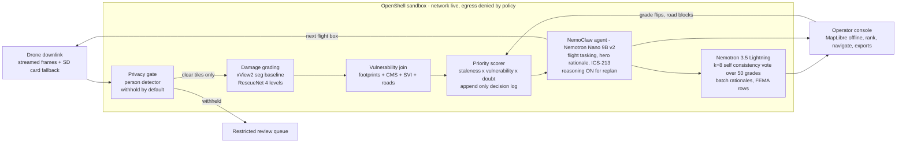

# FIRST LIGHT

**Offline disaster triage on one NVIDIA DGX Spark. Aerial photos in, ranked rescue plan out — with the room's network left plugged in, because policy keeps this box offline, not luck.**

Team plan for the NVIDIA DGX Spark Hackathon, August 2026. Three builders, one weekend, one box.

---

## 1. The pitch

After Hurricane Helene, roughly 74% of cell towers in the worst-hit counties failed ([FCC report](https://docs.fcc.gov/public/attachments/DOC-406055A1.pdf)). That is exactly when drone teams are collecting hundreds of gigabytes of damage imagery that can reach no cloud.

FIRST LIGHT is a county-owned box that turns a live drone downlink into a ranked, navigable rescue plan with zero connectivity:

`privacy gate -> damage grading -> vulnerability join -> auditable ranking -> next-flight tasking -> FEMA paperwork`

Two things make it a winner rather than a dashboard:

1. **It closes the loop.** The deployed state of the art (TAMU's CLARKE) emits one damage map and stops. We rank the doors, task the next flight, and re-rank on what comes back.
2. **It is contained on purpose.** An agent that tasks drones and drafts federal forms is an agent worth containing. Everything runs as a NemoClaw agent inside an NVIDIA OpenShell sandbox, and we leave the venue network **on** so the judges can watch OpenShell refuse an outbound request in real time, audit line printed on screen.

**Track:** See (streaming perception) + Do (contained agent).
**Bounties targeted:** Nemotron, Nemotron Lightning, NemoClaw + OpenShell.

> **Rules check, first 30 minutes.** We prototyped this concept before the event to de-risk the design. Confirm the event's fresh-code rules at check-in, write all submission code during the event, and disclose the earlier spike wherever the rules ask. The design is proven; the build is the weekend's work. Nobody claims otherwise on stage.

---

## 2. Judge criteria, answered before we write a line

| Criterion | Our answer | What the judge sees |
|---|---|---|
| Completeness: full workflow, no crash | Downlink to export, end to end | Tiles arrive and paint one by one |
| Streaming input (See track) | Frames stream to the box **during** the demo and are processed on arrival | Per-tile end-to-end latency on the HUD |
| Multi-step agent, branching (Do track) | rank -> find stale sectors -> task flight -> re-rank; invalid model output triggers a **self re-prompt with the validation error** before any fallback | Replan beat plus a visible self-correction, labelled "model recovered" vs "stub engaged" |
| NVIDIA stack | Nemotron Nano 9B v2 and Nemotron 3.5 Lightning, both local vLLM; NemoClaw agent inside OpenShell | Status bar names every model; audit panel is live |
| Spark story | Four models plus county GIS resident together, zero swap, in a 240 W box a county can own and run in a parking lot with the internet gone. Imagery never leaves the county. | Memory gauge and power figure on the HUD |
| Value and impact | An EOC gets a door-by-door plan the first morning, and every rank is auditable. Property value never enters life-safety ranking. | Rank rows show their formula inputs; the judge checks the arithmetic |
| Usable tomorrow | Locate, Navigate (printable turn-by-turn that avoids blocked roads), one-click FEMA PDA and ICS-213 | The judge drives it unaided |
| Innovation | A closed perception-decision loop nobody deploys, plus a live containment drill | Spoken contrast and a witnessed policy denial |
| Performance | **Measured, never quoted**: speculative-decoding before/after tokens per second, co-resident replan p95, per-tile latency | HUD numbers captioned "measured on this Spark" |

**Name the rival before a judge does.** NVIDIA's VSS blueprint does excellent streaming video analytics, but as shipped it assumes NGC keys, an AI Enterprise licence and datacenter GPUs — a hard fit for an air-gapped county EOC. We ship the decision loop and the federal paperwork VSS does not, fully offline. That is the answer to "why not just use VSS?"

---

## 3. Architecture



### Memory and bandwidth, honestly

The Spark is 128 GB unified memory at **273 GB/s**. Bandwidth is the real constraint, not capacity, and we say so before a hardware-literate judge says it for us.

| Component | Footprint | Note |
|---|---|---|
| Nemotron Nano 9B v2, FP8 | ~12 GB | Mamba-hybrid, only 4 attention layers, so the KV cache is unusually small |
| Nemotron 3.5 Lightning, 4-bit (NVFP4-class) weights | ~17 GB | Use whichever quantized build NVIDIA publishes for this box; confirm the exact name at check-in before saying it on stage |
| Damage seg + person detector | ~3 GB | |
| County GIS, map tiles, SQLite | ~20 GB | |
| KV pools, both servers | ~48 GB | vLLM pre-allocates to fill its utilization fraction |
| **Reserved total** | **~100 GB of 128 GB** | Zero swap, both LLMs warm, ~28 GB free |

**Do the arithmetic the way the gauge will.** vLLM does not reserve only the weights; it pre-allocates a KV pool to fill its `--gpu-memory-utilization` fraction. We set Nano to 0.25 (~32 GB total allocation: 12 weights + 20 KV) and Lightning to 0.35 (~45 GB total: 17 weights + 28 KV) — never the ~0.9 default, which would collide on the first request. Add it up: 12 + 17 + 3 + 20 + 48 = **~100 GB reserved, ~28 GB free**, and that is exactly what the HUD gauge shows. Bring a calculator; the slide and the gauge agree. Want a smaller number? Cap `--max-model-len` and shrink the fractions — then update this table in the same commit. The rule is that the table and the gauge never disagree. Shared 273 GB/s bandwidth is why every latency number is measured with **both** models warm — a single-model benchmark on this box is a lie by omission.

**Latency targets (so "blows its budget" has a threshold):** replan p95 **under 3 s** with both models warm, per-tile end-to-end under 10 s, hard stub timeout at 10 s.

---

## 4. Model roles, each earning its seat

| Model | Job | Why this model | Bounty |
|---|---|---|---|
| **Nemotron Nano 9B v2** (FP8, vLLM) | Decision-maker: flight tasking with reasoning **visibly on** (thinking trace streams during the replan beat), the one hero rationale, ICS-213 drafting. Cheap structured calls use `/no_think`. | We chose a reasoning model, so we show it reasoning once, where it matters, inside the demo beat | Best Use of Nemotron |
| **Nemotron 3.5 Lightning** (4-bit weights, vLLM) | The job only its throughput unlocks: **k=8 self-consistency voting that computes the `doubt` term** (see the ballot below), plus batch rationales for ranks 2-50 and FEMA PDA row fill. Speed buys *calibrated uncertainty* the slow model cannot afford at demo tempo. | 3B active of 30B MoE with multi-token prediction and speculative decoding. We configure it and measure the delta on this box. | Best Use of Nemotron Lightning |
| xView2 first-place seg | Building damage classes | Public weights, RescueNet taxonomy. **Baseline must work**; the RescueNet fine-tune is a Saturday stretch goal behind the same interface, never on the critical path | — |
| Person detector (YOLO class 0) | Privacy gate, before anything else reads a tile | Fast, conservative, and its recall is measurable | — |
| **NemoClaw + OpenShell** | The planner runs as a NemoClaw agent inside the OpenShell sandbox. Policy: deny all egress, filesystem scoped to `./data`, localhost inference only, rules at binary and destination level, scrollable audit feed in the UI | Out-of-process enforcement the agent cannot override, and we prove it live | NemoClaw + OpenShell |

### The Lightning ballot — what exactly is voted, and why it changes the ranking

The seg model owns the *initial* damage class. Lightning owns the *confidence in it*, and that is what feeds the priority formula.

| Step | Detail |
|---|---|
| Input per building | seg class + seg confidence + join context (footprint area, facility proximity, neighbour classes) |
| Ballot | Lightning samples the severity label **k=8 times at temperature 0.7**, structured-decoded to a single integer 0-3 |
| Output | `voted_class` = the modal label; `vote_agreement` = modal count / 8 |
| Wired into the rank | `doubt = 1 - vote_agreement`, floored at 0.05. So a building the fast model cannot agree with itself about **rises in the ranking**, which is exactly the behaviour we want: uncertainty means send someone to look |
| Eval, two distinct numbers | **Self-agreement**: mean `vote_agreement` across the 50 buildings (how sure Lightning is of itself). **Cross-model agreement**: how often Lightning's `voted_class` matches Nano's single-shot label on the same 50. Both published at gate 7 |

This is why the throughput matters and is impossible to hand-wave: 50 buildings × 8 samples = 400 structured generations inside a demo beat. Nano cannot do that and still stream a thinking trace. The speedup is not a vanity metric; it is the thing that produces the uncertainty column.

**If the measured speedup disappoints on Friday night** (acceptance rate low): drop k from 8 to 4, or vote only on the top 15 most-uncertain buildings. The mechanism survives; only the sample count moves. Never bet the beat on an unmeasured number.

### Two containment beats (this bounty is won on stage, not in prose)

The agent has real tools — `write_flight_plan`, `write_export`, `fetch_context(url)` — registered as NemoClaw tool-calls. Every beat below is the agent invoking one of its own tools and the runtime intercepting it. Nothing is a scripted `curl`; the audit line names `actor=agent`, which is the whole point.

**Beat 1 — positive control, so the denial means something.** Same network stack, two destinations. The agent's inference traffic to `localhost:8000` flows (allowed by destination rule, tokens visibly streaming). The same agent's `fetch_context` to the judge's external server is denied. One screen, one policy, two verdicts: *the network is up and policy discriminates by destination.* Without this control, "denied" could just mean "unplugged".

**Beat 2 — witnessed exfiltration denial.** A judge-pool tile carries a hostile caption instructing the agent to POST the parcel table to an external address. The agent, doing what its context told it, calls `fetch_context` on that address. OpenShell denies it out-of-process: binary, destination, verdict, timestamp, printed in the audit panel. Policy protected the agent from being turned into somebody else's tool.

**Beat 3 — the agent tries to widen its own cage, and cannot.** Still under the injected instruction, the agent attempts to rewrite the egress rule (and to read outside `./data` for the dropped owner-name file). Both denied. Audit shows `actor=agent, action=policy-write, verdict=deny` and `actor=agent, action=fs-read, path=../, verdict=deny`. This is the money shot: enforcement lives outside the process, so a hijacked agent cannot unhook it. **Non-cuttable.**

**Beat 4 — a human can widen it, with a receipt.** The operator needs a USB export. OpenShell denies the unapproved path; a named human approves a scoped policy delta; the audit records who, what and when; the export succeeds. Autonomy inside boundaries, changed only by a person. *Pre-record this one* so a time crunch cannot take it off the table.

**Prove the audit panel is not our own UI lying.** Beside the styled panel we tail OpenShell's raw audit stream in a terminal, same source, append-only. A judge can watch a line appear in the runtime log and then in our UI. Publish one measured number too: OpenShell's enforcement overhead on localhost inference in added milliseconds, captioned "measured on this Spark" — a sandbox that costs nothing is a sandbox nobody will remove.

**Threat model, stated up front.** We treat the agent's context and every model output as fully attacker-controlled: any tile caption, EXIF field or filename may be hostile. We trust the OpenShell runtime and the host kernel. Out of scope for the weekend: kernel exploits, a malicious host, and side-channel egress. Output corruption is partly covered (structured decoding + the k=8 vote) and we say so rather than claiming it is solved.

**Say it in the rubric's own words in the write-up:** the policy bounds the blast radius so that even a fully hijacked agent cannot exfiltrate, escalate, or act outside `./data`. OpenShell protects the agent from being weaponised, and it protects the county's data from the agent.

### Where containment stops, and what covers the rest

OpenShell contains **exfiltration**. It does not contain **output corruption**, and Lightning sits on the untrusted-content path, so we say this plainly and cover it separately: structured-only decoding, Lightning's k=8 vote, and an injection fixture in the eval suite. A hostile caption must not flip a damage grade or a FEMA field.

### How Lightning is actually optimized (not just "we ran it")

| Knob | What we do | Evidence on the HUD |
|---|---|---|
| Speculative decoding | Configure a draft-target pair (use NVIDIA's published drafter for this model if one ships; otherwise a small Nemotron as drafter), record token acceptance rate | Before/after tokens per second |
| Quantization | 4-bit weights as the default, not a panic fallback | Memory and throughput it buys |
| Batching | Sweep batch size to find the throughput knee, then pin it | Chosen batch size, stated with the reason |
| Spend of the speedup | k=8 self-consistency instead of k=1 | Vote agreement rate versus Nano |

The one sentence that wins this bounty on stage: *"Speculative decoding took this batch from X to Y tokens per second, and that headroom is exactly what lets us vote eight times on all fifty buildings inside a three-minute demo."*

---

## 5. Three people, three streams, zero waiting

Each member pairs with an AI coding agent. Section 7 is the technique; Appendix A holds a ready-to-paste seed prompt per member. Streams share only the contracts in section 6, frozen in hour one.

### Member A — Perception and Data
*Motto: nothing unsafe, nothing stale.*

| # | Deliverable | Detail |
|---|---|---|
| A1 | Streaming ingest | Receive frames over **RTSP** (frozen choice — the defensible "real downlink" story) plus watch-folder and SD-card fallback; content-hash dedup; emit per-tile end-to-end latency |
| A2 | Privacy gate | Person detection **before any other component reads the tile**; withhold to a restricted queue; detector error also withholds; fixture test proves a person tile never appears in any API response except the authorized review endpoint |
| A3 | Damage grading | xView2 baseline that must work; RescueNet fine-tune only as a stretch goal behind the same function signature |
| A4 | Data joins | Building footprints, CMS Care Compare facilities (facility-level only), CDC SVI block groups, county parcels with owner names dropped at ingest |
| A5 | Gate eval | Person-recall on 100 held-out tiles, number published in the README |

### Member B — Decision and Agent
*Motto: every rank auditable, every number measured.*

| # | Deliverable | Detail |
|---|---|---|
| B1 | Priority scorer | `priority = staleness x vulnerable_density x doubt [x road_cutoff]`. Round each factor to 3 decimals **first**, then multiply, so the on-screen product reconciles exactly. Operator-confirmed severe damage (class >= 2) pins to the top. Append-only log enforced by SQL triggers |
| B2 | NemoClaw agent | Nano 9B v2 on vLLM at `--gpu-memory-utilization 0.25`; reasoning on for flight tasking, `/no_think` elsewhere; guided JSON; on schema-invalid output **re-prompt once with the validation error** before any stub; expose a demo flag that forces one invalid first attempt so the recovery path is demonstrable on demand; measure co-resident p95 |
| B3 | Lightning layer | vLLM at `--gpu-memory-utilization 0.35`, 4-bit weights; speculative decoding configured and measured; batch-size sweep; k=8 self-consistency vote; before/after numbers to the HUD |
| B4 | Offline routing | Dijkstra over the OSM node graph; blocked roads banned at edge level (by name and geometrically); when no clean route exists, say so loudly and never silently |
| B5 | Containment | NemoClaw inside OpenShell; policy file; both stage beats; audit feed API; the bounty write-up |
| B6 | LLM eval, gate 7 | (a) rationale faithfulness: cited inputs equal scorer inputs, auto-checked; (b) FEMA field accuracy on a small labeled set; (c) two agreement numbers: Lightning self-agreement and Lightning-versus-Nano agreement; (d) injection battery: N hostile captions must produce **0 altered grades and 0 altered FEMA fields**, plus a policy-tamper attempt that OpenShell denies. All four published with their pass criteria |

### Member C — Operator Console and Demo
*Motto: readable from the back of the room.*

| # | Deliverable | Detail |
|---|---|---|
| C1 | Map console | MapLibre with pre-downloaded dark and satellite tiles; damage polygons; facility markers as a medical cross, never a blue dot; blocked roads red; flight box plus survey path |
| C2 | Rank panel | Address labels from real data, not raw IDs; formula inputs visible; confidence and doubt bars; grade-flip logged by operator name; Locate and Navigate buttons per row |
| C3 | Exports | FEMA PDA CSV with in-page preview, ICS-213, flight plan as QGroundControl `.plan` and GeoJSON. Other drone formats only if ahead of schedule |
| C4 | HUD + vote column | Tiles processed and withheld, per-tile latency, model names with measured tokens per second, memory gauge, OpenShell policy state, scrollable audit records, and a "model recovered" versus "stub engaged" indicator. **Plus the vote column in the rank panel: 8 tally pips per row filling live, and a doubt bar** — this is Lightning's only visible moment, so it must read from the back of the room |
| C5 | Demo kit | The 3-minute script, a pre-gated judge tile pool, the hostile-caption fixture tile, a `--demo-force-invalid-first-replan` flag (guarantees the self-recovery beat fires live), a canned recording one keypress away, and a one-command reseed |

---

## 6. Interface contracts — complete, frozen, code against these

Copy these into every AI prompt. If a field is missing here, add it here first, then tell the other two.

**Damage classes.** `class` is an integer: `0 = no-damage, 1 = minor, 2 = major, 3 = destroyed`. "Severe" means `class >= 2`. Never use strings on the wire.

**Coordinates.** Every coordinate pair is `[lng, lat]`, GeoJSON order, matching MapLibre. Bounds are `[west, south, east, north]`.

| Contract | Direction | Exact shape |
|---|---|---|
| Tile record | A to B | `{filename: str, bounds: [w,s,e,n], status: "processed" or "withheld" or "error", captured_at: float, latency_ms: int, buildings: [{id: str, class: 0-3, conf: 0.0-1.0}]}` |
| Rank item | B to C | `{footprint_id: str, label: str, centroid: [lng,lat], damage_class: 0-3, confidence: float, confirmed: bool, graded_by: str, facility_near: {name: str, type: str, dist_m: int} or null, inputs: {staleness_h: float, vulnerable_density: float, doubt: float, road_cutoff: float or null}, priority: float, rationale: str, rationale_by: "nano" or "lightning"}` |
| Flight plan | B to C | GeoJSON FeatureCollection with two features: `properties.role = "survey-area"` (Polygon) and `properties.role = "survey-path"` (LineString with `altitude_m_agl`, `line_spacing_m`, `transects`, `est_flight_min`) |
| Route | B to C | `{ok: bool, geometry: LineString, steps: [{text: str, dist_m: int}], distance_m: int, eta_min: float, crosses_blockage: bool, blocked_roads_avoided: [str], warning: str or null}` |
| Status | all to C | `{tiles_processed: int, tiles_withheld: int, tile_latency_ms_p50: int, model_versions: {gate, damage, planner, lightning}, tokens_per_s: {nano: float, lightning: float}, memory_gb: float, last_replan_ms: int, recovery: "model" or "stub" or null, openshell: {policy: str, denials: int, audit: [{ts, actor, action, destination, verdict}]}}` |
| Grade flip | **C to B** | `{footprint_id: str, new_class: 0-3, operator: str}` |
| Road block | **C to B** | `{road_name: str, geometry: LineString, blocked: bool, operator: str}` — B bans by name **and** geometry |

**Field semantics, so nobody invents them:**

- `graded_by` — `"xview2"` until an operator flips it, then `"operator:<name>"`. Lightning never grades the class; it owns the `doubt` term only.
- `road_cutoff` — a multiplier **>= 1** that *raises* priority for buildings cut off by a blocked road; `null` when access is clear.
- `facility_near.type` — one of `nursing_home`, `dialysis`, `hospital`. Those three get the medical-cross marker.
- `captured_at` — epoch seconds, float.
- **List ordering is B's job.** B returns the rank list already sorted: confirmed-severe first as a *sort tiebreaker*, then priority descending. Pinning never inflates `priority`, so gate 4's arithmetic still reconciles. C renders in the order received.

**Where `doubt` comes from:** `doubt = max(0.05, 1 - vote_agreement)` from the Lightning ballot. Before Lightning is wired, use `1 - seg_confidence` so B1 is never blocked on B3.

**Reconciliation rule (gate 4 depends on it):** `priority == round(staleness_h,3) * round(vulnerable_density,3) * round(doubt,3) * (road_cutoff or 1)`, itself rounded to 5 decimals. Member C displays those same rounded factors, so a judge with a calculator always agrees.

---

## 7. How we build this fast with AI pairs

Seven techniques that earned their place on the design spike. Use them verbatim.

1. **Contract-first prompting.** Paste the relevant contract from section 6 into every prompt, plus the non-negotiable. Example: *"Build the ingest watcher. It must emit exactly this Tile record shape. The privacy gate runs before any other read of the file — this is non-negotiable."* The agent then keeps modules compatible without you coordinating.
2. **One module per session.** Fresh context for the gate, the scorer, the routing graph. Long sessions drift; contracts keep the pieces aligned anyway.
3. **Demand the test with the feature.** *"...and write the fixture test proving a person tile never appears in any API response except the authorized review endpoint."* Non-negotiables become executable.
4. **Adversarial review loop.** After each milestone, open a second session as a hostile judge: *"You are a demo-day skeptic. Here is the API and the UI. Find everything that reads as fake, breaks under fast clicking, or contradicts our pitch."* On the prototype this loop caught the three worst bugs: on-screen rank arithmetic that did not reconcile, the hero building vanishing from the list after an operator confirmed it, and routes that silently crossed blocked roads. Humans found none of those.
5. **Geometric truth over string truth.** For anything spatial, assert on geometry — route line intersected with the blocked-road buffer must be under 30 m — never on step text. AI-written tests love string matching, which passes while the map lies.
6. **Stub behind the real interface.** Every model gets a deterministic fallback with an identical signature, labelled in the status bar. The demo never dies, honesty is preserved, and the real model drops in with no code change.
7. **Reseed script from hour one.** One command returns the box to pristine demo state. You will run it fifty times.

---

## 8. Weekend timeline

| When | Member A | Member B | Member C |
|---|---|---|---|
| Fri, first hour | Rules check together, then contracts frozen (section 6) | — | — |
| Fri evening | Download every weight, dataset and map tile — last internet! | Both vLLM instances up; verify Nano + Lightning co-residency; configure speculative decoding; capture baseline numbers | Repo scaffold, offline tile cache, static UI shell |
| Sat morning | Streaming ingest + privacy gate + fixture test | Scorer + decision log + first Nano rationale | Map painting against a stub API |
| Sat afternoon | Seg inference wired; data joins | Flight tasking with guided JSON; Lightning k=8 sweep | Rank panel, grade-flip, HUD |
| Sat evening | Gate recall eval; SD-card path | Routing with blocked roads; OpenShell policy + both beats | Navigate, print view, exports |
| **Sun 09:00** | **Integration starts, no matter what is unfinished** | | |
| Sun morning | 200-tile end-to-end run, fix everything found | p95 with both models warm; LLM eval suite (B6); failure drills | Rehearse the script three times; build the judge tile pool |
| Sun afternoon | Freeze. Reseed. Rehearse. Record the backup video. Write the bounty submissions. | | |

**The 80% rule:** a working 80% beats a broken 100%. Integration starts Sunday 9 AM sharp even if something is half-built.

### Cut list — drop in this order when behind

1. Extra flight-plan formats (keep QGroundControl `.plan` and GeoJSON)
2. Satellite basemap layer (keep the dark tactical map)
3. RescueNet fine-tune (keep the xView2 baseline)
4. SD-card auto-mount (keep the watch folder and the live stream)
5. Live delivery of the human-approved policy delta — play the pre-recorded version instead (the denial and self-tamper beats stay live; they are the bounty)

**Never cuttable:** the privacy gate, containment beats 1-3, and gates 1-6. Gate 7 degrades gracefully — publish whatever eval subset is measured and mark the rest "not reached" rather than declaring the system unfinished.

---

## 9. Risks, each with a pre-decided answer

| Risk | Answer |
|---|---|
| Both models will not fit or contend for bandwidth | Measured Friday night with explicit utilization splits. If tight, Lightning stays (it is the bounty centrepiece) and Nano drops to 4-bit. We never discover this on Sunday. |
| Replan blows its latency budget | Token cap plus prefill cap already sized; p95 measured with both models warm; narration covers any gap; a hard 10 s timeout fires the stub, and the HUD says which happened |
| xView2 weights misbehave on this imagery | Vision-model grading fallback behind the same interface, disclosed in the status bar |
| OpenShell blocks our own vLLM sockets | Policy allows localhost:8000 and :8001 explicitly, tested Friday. If it still fights us, run inference inside the sandbox too |
| A judge does something unexpected in the UI | Everything visible is safe to click; one-command reseed; recorded backup a keypress away |
| The confident-wrong grade appears on stage | That is the scripted operator-override beat: "high confidence and wrong, which is exactly why a named human owns the final call." Flip it live, watch the tally update |

---

## 10. Definition of done — seven gates

Run all seven Sunday afternoon. Any red light means we are not finished.

| # | Gate |
|---|---|
| 1 | One command brings the whole system up with the network policy denying egress |
| 2 | Ten tiles streamed in paint damage polygons on the map, each within seconds of arrival |
| 3 | A fixture tile containing a person is withheld and appears in no UI or API surface except the authorized review endpoint |
| 4 | Every rank row shows its formula inputs, the displayed product reconciles, and a grade flip updates the tally and pins confirmed severe damage to the top |
| 5 | Blocking a road and replanning yields a new flight area plus a flyable survey path, and Navigate produces turn-by-turn that geometrically avoids the blocked road or warns loudly |
| 6 | The FEMA PDA export opens in a spreadsheet with one row per damaged building |
| 7 | The eval numbers are published: gate recall, rationale faithfulness, FEMA field accuracy, Lightning-versus-Nano agreement, and the injection fixture result |

---

## 11. The three-minute demo

| Time | Beat | On screen |
|---|---|---|
| 0:00 | "~100 GB resident, both models warm, and the venue network is up. Watch: our own inference traffic flows to localhost, and the same agent's request to your server is refused. Policy, not an unplugged cable." | HUD: policy `deny-all-egress`, one allow and one deny side by side in the audit panel, memory gauge, both models warm |
| 0:20 | Judge starts the downlink from the pre-gated pool | Tiles arrive live, polygons paint, per-tile latency ticks, withheld counter increments once: "the privacy gate held that tile back; it never reached a screen" |
| 1:00 | **Lightning's beat.** The uncertainty column fills in live: fifty rows, each showing 8 tally pips and a doubt bar, completing in one visible sweep | "The fast model just voted eight times on all fifty buildings — four hundred generations — in the time the reasoning model wrote one sentence. That column is what re-orders the list." Spec-decode before/after tokens per second on the HUD |
| 1:35 | **"Both bridges on the arterial are out. Replan."** The demo flag forces the agent's first flight plan to come back schema-invalid, so this beat fires every time; the HUD flips to **model recovered** as it re-prompts itself with the validation error, the retry is guided-JSON constrained so it lands valid, then it streams its thinking trace and produces the plan. Navigate reroutes with printable directions | Route detours live, flight box jumps to the cut-off sector, replan p95 on the HUD, recovery indicator witnessed |
| 2:15 | **Containment.** The poisoned caption fires. The agent calls its own fetch tool on an external address — denied. It tries to rewrite its egress rule — denied. It tries to read outside `./data` — denied. | Three audit lines print: `actor=agent`, action, destination, verdict, timestamp |
| 2:35 | FEMA PDA, ICS-213 and the QGroundControl flight plan export | "The paperwork the county files, drafted before comms return" |
| 2:50 | Close | "One box. No cloud. The county owns it. The same policy that stops a hijacked agent is what makes this thing work when the network is gone." |

**Rehearsed contingencies:** every model beat has a stub that keeps the demo moving and labels itself as such; the policy-delta beat is pre-recorded; a full run recording is one keypress away; and the confident-wrong grade, if it appears, becomes the operator-override beat rather than an accident.

---

## Appendix A — Seed prompts

Paste these into your AI coding agent at the start of each session, with the relevant contract from section 6 appended verbatim.

### Member A

```
You are building the perception front end of FIRST LIGHT, an offline disaster-triage
system that runs on one NVIDIA DGX Spark with no internet access.

Build ONE module at a time. Right now: <module name>.

Non-negotiables:
1. The privacy gate runs BEFORE any other component reads a tile. If the person
   detector errors or is uncertain, the tile is withheld. Withheld tiles are
   reachable only from an authorized review endpoint.
2. Emit exactly this Tile record shape: <paste contract>
3. Damage classes are integers 0-3 (0 no-damage, 1 minor, 2 major, 3 destroyed).
4. Coordinates are [lng, lat]; bounds are [w, s, e, n].
5. No network calls to anything except localhost.

Deliver the module plus a runnable test proving non-negotiable 1. Use pytest,
no new frameworks, no scaffolding for later.
```

### Member B

```
You are building the decision layer of FIRST LIGHT, an offline disaster-triage
system on one NVIDIA DGX Spark. Two local vLLM servers are available:
Nemotron Nano 9B v2 on :8000 and Nemotron 3.5 Lightning on :8001.

Build ONE module at a time. Right now: <module name>.

Non-negotiables:
1. priority = staleness_h x vulnerable_density x doubt x (road_cutoff or 1).
   Round each factor to 3 decimals BEFORE multiplying so the on-screen product
   reconciles exactly. Property value never enters the formula.
2. The decision log is append-only, enforced by SQL triggers, not by convention.
3. Every model call has a hard timeout and a deterministic fallback with an
   identical signature. Label which one ran in the response.
4. Consume/emit exactly these contracts: <paste contracts>
5. When the model returns schema-invalid JSON, re-prompt ONCE with the validation
   error before falling back.

Deliver the module plus tests. For anything spatial, assert on geometry
(intersection lengths, buffers), never on step text.
```

### Member C

```
You are building the operator console for FIRST LIGHT, an offline disaster-triage
system. Single-page app, MapLibre GL, vendored dependencies, no build step.
Dark theme on #0a0d12, one green accent #76b900, one blue secondary #4cc2ff.

Build ONE panel at a time. Right now: <panel name>.

Non-negotiables:
1. Every screen readable from across a room. No purple gradients, no template look.
2. Every button and every non-obvious term has a plain-English tooltip that works
   on hover AND on touch.
3. Consume exactly these contracts, and never invent fields: <paste contracts>
4. Basemap tiles come from the local cache only. No CDN, no font server, no
   external style URL.
5. A 5-second refresh must never close a panel the operator has open.

Deliver the panel and tell me exactly which API fields it reads.
```

### The judge prompt (all three, after every milestone)

```
You are a hostile hackathon judge for the NVIDIA DGX Spark hackathon. Criteria:
technical depth over wrappers, real NVIDIA stack usage, streaming input, a
multi-step agent with branching and error recovery, and a credible "why a Spark"
story. Here is our API and UI: <paste>. Exercise it, do not just read it.

Find: anything that reads as fake or unfinished on screen, anything that breaks
under fast or repeated clicking, any claim in our pitch the artifact does not
support, and any number we assert without measuring. Return findings as
P0 (demo killer) / P1 (credibility) / P2 (polish), each with a concrete fix.
```

---

*The design in this document was de-risked before the event, so the weekend is spent building rather than discovering. Every number that reaches a judge's eyes is measured on the box in front of them.*
